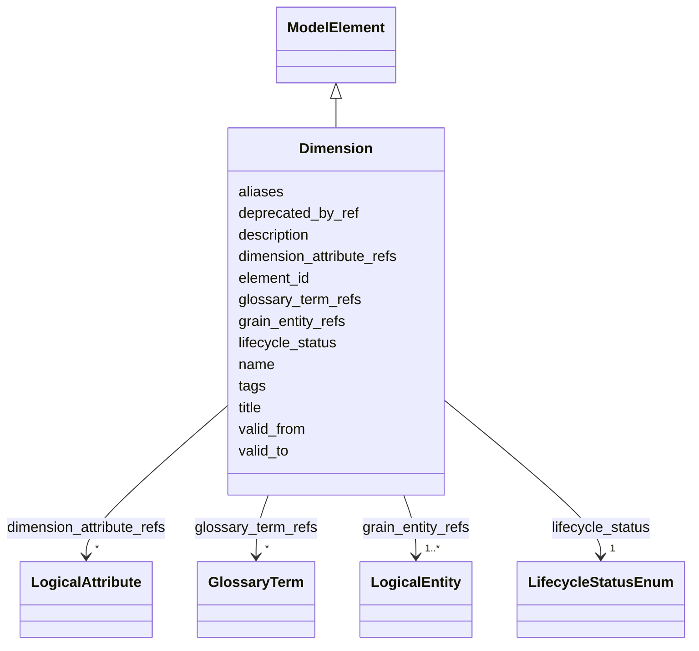

```mermaid
 classDiagram
    class Dimension
    click Dimension href "../Dimension"
      ModelElement <|-- Dimension
        click ModelElement href "../ModelElement"
      
      Dimension : aliases
        
      Dimension : deprecated_by_ref
        
      Dimension : description
        
      Dimension : dimension_attribute_refs
        
          
    
        
        
        Dimension --> "*" LogicalAttribute : dimension_attribute_refs
        click LogicalAttribute href "../LogicalAttribute"
    

        
      Dimension : element_id
        
      Dimension : glossary_term_refs
        
          
    
        
        
        Dimension --> "*" GlossaryTerm : glossary_term_refs
        click GlossaryTerm href "../GlossaryTerm"
    

        
      Dimension : grain_entity_refs
        
          
    
        
        
        Dimension --> "1..*" LogicalEntity : grain_entity_refs
        click LogicalEntity href "../LogicalEntity"
    

        
      Dimension : lifecycle_status
        
          
    
        
        
        Dimension --> "1" LifecycleStatusEnum : lifecycle_status
        click LifecycleStatusEnum href "../LifecycleStatusEnum"
    

        
      Dimension : name
        
      Dimension : tags
        
      Dimension : title
        
      Dimension : valid_from
        
      Dimension : valid_to
        
      
```
