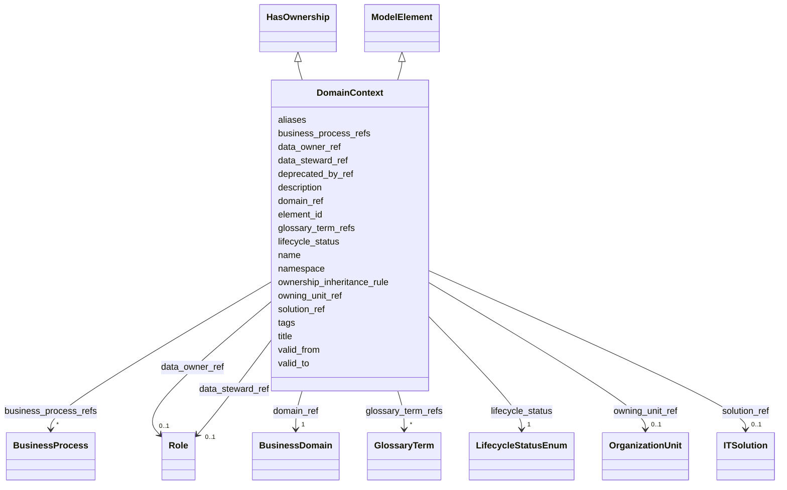

```mermaid
 classDiagram
    class DomainContext
    click DomainContext href "../DomainContext"
      HasOwnership <|-- DomainContext
        click HasOwnership href "../HasOwnership"
      ModelElement <|-- DomainContext
        click ModelElement href "../ModelElement"
      
      DomainContext : aliases
        
      DomainContext : business_process_refs
        
          
    
        
        
        DomainContext --> "*" BusinessProcess : business_process_refs
        click BusinessProcess href "../BusinessProcess"
    

        
      DomainContext : data_owner_ref
        
          
    
        
        
        DomainContext --> "0..1" Role : data_owner_ref
        click Role href "../Role"
    

        
      DomainContext : data_steward_ref
        
          
    
        
        
        DomainContext --> "0..1" Role : data_steward_ref
        click Role href "../Role"
    

        
      DomainContext : deprecated_by_ref
        
      DomainContext : description
        
      DomainContext : domain_ref
        
          
    
        
        
        DomainContext --> "1" BusinessDomain : domain_ref
        click BusinessDomain href "../BusinessDomain"
    

        
      DomainContext : element_id
        
      DomainContext : glossary_term_refs
        
          
    
        
        
        DomainContext --> "*" GlossaryTerm : glossary_term_refs
        click GlossaryTerm href "../GlossaryTerm"
    

        
      DomainContext : lifecycle_status
        
          
    
        
        
        DomainContext --> "1" LifecycleStatusEnum : lifecycle_status
        click LifecycleStatusEnum href "../LifecycleStatusEnum"
    

        
      DomainContext : name
        
      DomainContext : namespace
        
      DomainContext : ownership_inheritance_rule
        
      DomainContext : owning_unit_ref
        
          
    
        
        
        DomainContext --> "0..1" OrganizationUnit : owning_unit_ref
        click OrganizationUnit href "../OrganizationUnit"
    

        
      DomainContext : solution_ref
        
          
    
        
        
        DomainContext --> "0..1" ITSolution : solution_ref
        click ITSolution href "../ITSolution"
    

        
      DomainContext : tags
        
      DomainContext : title
        
      DomainContext : valid_from
        
      DomainContext : valid_to
        
      
```
