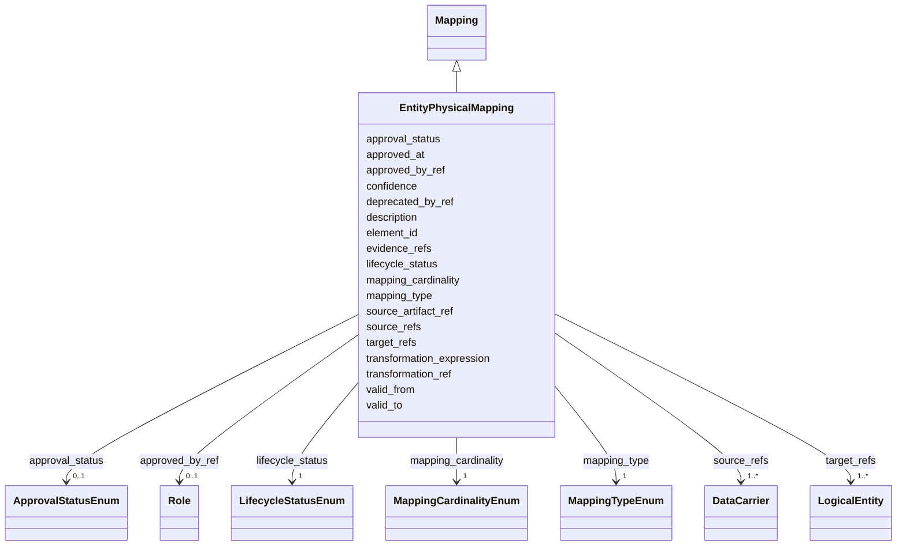

```mermaid
 classDiagram
    class EntityPhysicalMapping
    click EntityPhysicalMapping href "../EntityPhysicalMapping"
      Mapping <|-- EntityPhysicalMapping
        click Mapping href "../Mapping"
      
      EntityPhysicalMapping : approval_status
        
          
    
        
        
        EntityPhysicalMapping --> "0..1" ApprovalStatusEnum : approval_status
        click ApprovalStatusEnum href "../ApprovalStatusEnum"
    

        
      EntityPhysicalMapping : approved_at
        
      EntityPhysicalMapping : approved_by_ref
        
          
    
        
        
        EntityPhysicalMapping --> "0..1" Role : approved_by_ref
        click Role href "../Role"
    

        
      EntityPhysicalMapping : confidence
        
      EntityPhysicalMapping : deprecated_by_ref
        
      EntityPhysicalMapping : description
        
      EntityPhysicalMapping : element_id
        
      EntityPhysicalMapping : evidence_refs
        
      EntityPhysicalMapping : lifecycle_status
        
          
    
        
        
        EntityPhysicalMapping --> "1" LifecycleStatusEnum : lifecycle_status
        click LifecycleStatusEnum href "../LifecycleStatusEnum"
    

        
      EntityPhysicalMapping : mapping_cardinality
        
          
    
        
        
        EntityPhysicalMapping --> "1" MappingCardinalityEnum : mapping_cardinality
        click MappingCardinalityEnum href "../MappingCardinalityEnum"
    

        
      EntityPhysicalMapping : mapping_type
        
          
    
        
        
        EntityPhysicalMapping --> "1" MappingTypeEnum : mapping_type
        click MappingTypeEnum href "../MappingTypeEnum"
    

        
      EntityPhysicalMapping : source_artifact_ref
        
      EntityPhysicalMapping : source_refs
        
          
    
        
        
        EntityPhysicalMapping --> "1..*" DataCarrier : source_refs
        click DataCarrier href "../DataCarrier"
    

        
      EntityPhysicalMapping : target_refs
        
          
    
        
        
        EntityPhysicalMapping --> "1..*" LogicalEntity : target_refs
        click LogicalEntity href "../LogicalEntity"
    

        
      EntityPhysicalMapping : transformation_expression
        
      EntityPhysicalMapping : transformation_ref
        
      EntityPhysicalMapping : valid_from
        
      EntityPhysicalMapping : valid_to
        
      
```
