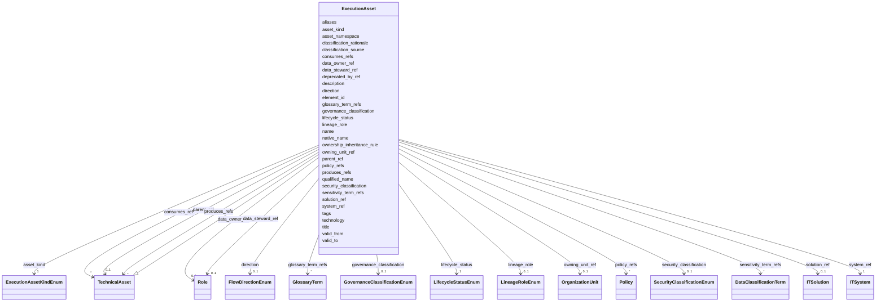

```mermaid
 classDiagram
    class ExecutionAsset
    click ExecutionAsset href "../ExecutionAsset"
      TechnicalAsset <|-- ExecutionAsset
        click TechnicalAsset href "../TechnicalAsset"
      
      ExecutionAsset : aliases
        
      ExecutionAsset : asset_kind
        
          
    
        
        
        ExecutionAsset --> "1" ExecutionAssetKindEnum : asset_kind
        click ExecutionAssetKindEnum href "../ExecutionAssetKindEnum"
    

        
      ExecutionAsset : asset_namespace
        
      ExecutionAsset : classification_rationale
        
      ExecutionAsset : classification_source
        
      ExecutionAsset : consumes_refs
        
          
    
        
        
        ExecutionAsset --> "*" TechnicalAsset : consumes_refs
        click TechnicalAsset href "../TechnicalAsset"
    

        
      ExecutionAsset : data_owner_ref
        
          
    
        
        
        ExecutionAsset --> "0..1" Role : data_owner_ref
        click Role href "../Role"
    

        
      ExecutionAsset : data_steward_ref
        
          
    
        
        
        ExecutionAsset --> "0..1" Role : data_steward_ref
        click Role href "../Role"
    

        
      ExecutionAsset : deprecated_by_ref
        
      ExecutionAsset : description
        
      ExecutionAsset : direction
        
          
    
        
        
        ExecutionAsset --> "0..1" FlowDirectionEnum : direction
        click FlowDirectionEnum href "../FlowDirectionEnum"
    

        
      ExecutionAsset : element_id
        
      ExecutionAsset : glossary_term_refs
        
          
    
        
        
        ExecutionAsset --> "*" GlossaryTerm : glossary_term_refs
        click GlossaryTerm href "../GlossaryTerm"
    

        
      ExecutionAsset : governance_classification
        
          
    
        
        
        ExecutionAsset --> "0..1" GovernanceClassificationEnum : governance_classification
        click GovernanceClassificationEnum href "../GovernanceClassificationEnum"
    

        
      ExecutionAsset : lifecycle_status
        
          
    
        
        
        ExecutionAsset --> "1" LifecycleStatusEnum : lifecycle_status
        click LifecycleStatusEnum href "../LifecycleStatusEnum"
    

        
      ExecutionAsset : lineage_role
        
          
    
        
        
        ExecutionAsset --> "0..1" LineageRoleEnum : lineage_role
        click LineageRoleEnum href "../LineageRoleEnum"
    

        
      ExecutionAsset : name
        
      ExecutionAsset : native_name
        
      ExecutionAsset : ownership_inheritance_rule
        
      ExecutionAsset : owning_unit_ref
        
          
    
        
        
        ExecutionAsset --> "0..1" OrganizationUnit : owning_unit_ref
        click OrganizationUnit href "../OrganizationUnit"
    

        
      ExecutionAsset : parent_ref
        
          
    
        
        
        ExecutionAsset --> "0..1" TechnicalAsset : parent_ref
        click TechnicalAsset href "../TechnicalAsset"
    

        
      ExecutionAsset : policy_refs
        
          
    
        
        
        ExecutionAsset --> "*" Policy : policy_refs
        click Policy href "../Policy"
    

        
      ExecutionAsset : produces_refs
        
          
    
        
        
        ExecutionAsset --> "*" TechnicalAsset : produces_refs
        click TechnicalAsset href "../TechnicalAsset"
    

        
      ExecutionAsset : qualified_name
        
      ExecutionAsset : security_classification
        
          
    
        
        
        ExecutionAsset --> "0..1" SecurityClassificationEnum : security_classification
        click SecurityClassificationEnum href "../SecurityClassificationEnum"
    

        
      ExecutionAsset : sensitivity_term_refs
        
          
    
        
        
        ExecutionAsset --> "*" DataClassificationTerm : sensitivity_term_refs
        click DataClassificationTerm href "../DataClassificationTerm"
    

        
      ExecutionAsset : solution_ref
        
          
    
        
        
        ExecutionAsset --> "0..1" ITSolution : solution_ref
        click ITSolution href "../ITSolution"
    

        
      ExecutionAsset : system_ref
        
          
    
        
        
        ExecutionAsset --> "1" ITSystem : system_ref
        click ITSystem href "../ITSystem"
    

        
      ExecutionAsset : tags
        
      ExecutionAsset : technology
        
      ExecutionAsset : title
        
      ExecutionAsset : valid_from
        
      ExecutionAsset : valid_to
        
      
```
