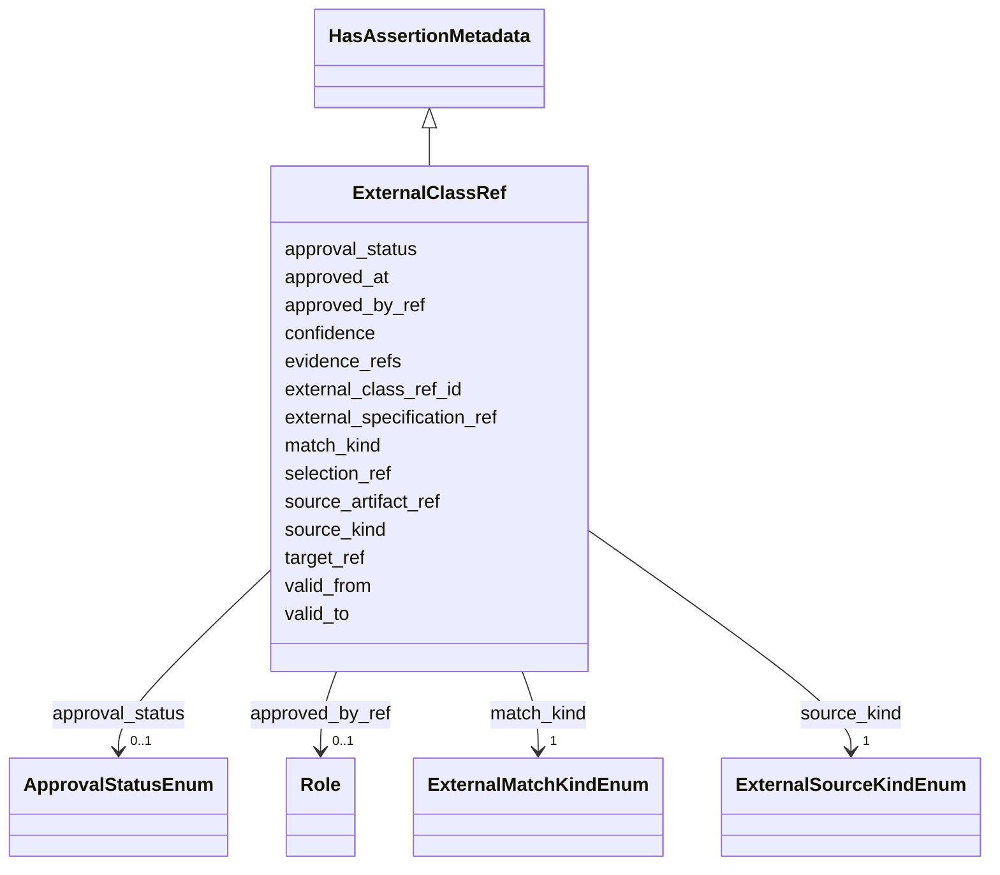

```mermaid
 classDiagram
    class ExternalClassRef
    click ExternalClassRef href "../ExternalClassRef"
      HasAssertionMetadata <|-- ExternalClassRef
        click HasAssertionMetadata href "../HasAssertionMetadata"
      
      ExternalClassRef : approval_status
        
          
    
        
        
        ExternalClassRef --> "0..1" ApprovalStatusEnum : approval_status
        click ApprovalStatusEnum href "../ApprovalStatusEnum"
    

        
      ExternalClassRef : approved_at
        
      ExternalClassRef : approved_by_ref
        
          
    
        
        
        ExternalClassRef --> "0..1" Role : approved_by_ref
        click Role href "../Role"
    

        
      ExternalClassRef : confidence
        
      ExternalClassRef : evidence_refs
        
      ExternalClassRef : external_class_ref_id
        
      ExternalClassRef : external_specification_ref
        
      ExternalClassRef : match_kind
        
          
    
        
        
        ExternalClassRef --> "1" ExternalMatchKindEnum : match_kind
        click ExternalMatchKindEnum href "../ExternalMatchKindEnum"
    

        
      ExternalClassRef : selection_ref
        
      ExternalClassRef : source_artifact_ref
        
      ExternalClassRef : source_kind
        
          
    
        
        
        ExternalClassRef --> "1" ExternalSourceKindEnum : source_kind
        click ExternalSourceKindEnum href "../ExternalSourceKindEnum"
    

        
      ExternalClassRef : target_ref
        
      ExternalClassRef : valid_from
        
      ExternalClassRef : valid_to
        
      
```
