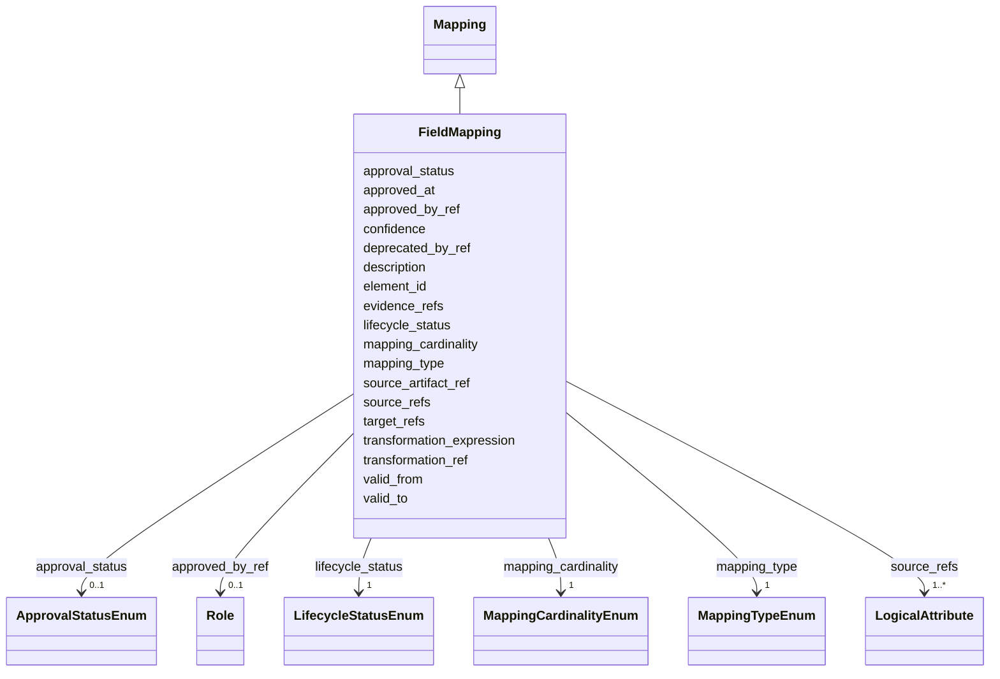

```mermaid
 classDiagram
    class FieldMapping
    click FieldMapping href "../FieldMapping"
      Mapping <|-- FieldMapping
        click Mapping href "../Mapping"
      
      FieldMapping : approval_status
        
          
    
        
        
        FieldMapping --> "0..1" ApprovalStatusEnum : approval_status
        click ApprovalStatusEnum href "../ApprovalStatusEnum"
    

        
      FieldMapping : approved_at
        
      FieldMapping : approved_by_ref
        
          
    
        
        
        FieldMapping --> "0..1" Role : approved_by_ref
        click Role href "../Role"
    

        
      FieldMapping : confidence
        
      FieldMapping : deprecated_by_ref
        
      FieldMapping : description
        
      FieldMapping : element_id
        
      FieldMapping : evidence_refs
        
      FieldMapping : lifecycle_status
        
          
    
        
        
        FieldMapping --> "1" LifecycleStatusEnum : lifecycle_status
        click LifecycleStatusEnum href "../LifecycleStatusEnum"
    

        
      FieldMapping : mapping_cardinality
        
          
    
        
        
        FieldMapping --> "1" MappingCardinalityEnum : mapping_cardinality
        click MappingCardinalityEnum href "../MappingCardinalityEnum"
    

        
      FieldMapping : mapping_type
        
          
    
        
        
        FieldMapping --> "1" MappingTypeEnum : mapping_type
        click MappingTypeEnum href "../MappingTypeEnum"
    

        
      FieldMapping : source_artifact_ref
        
      FieldMapping : source_refs
        
          
    
        
        
        FieldMapping --> "1..*" LogicalAttribute : source_refs
        click LogicalAttribute href "../LogicalAttribute"
    

        
      FieldMapping : target_refs
        
      FieldMapping : transformation_expression
        
      FieldMapping : transformation_ref
        
      FieldMapping : valid_from
        
      FieldMapping : valid_to
        
      
```
