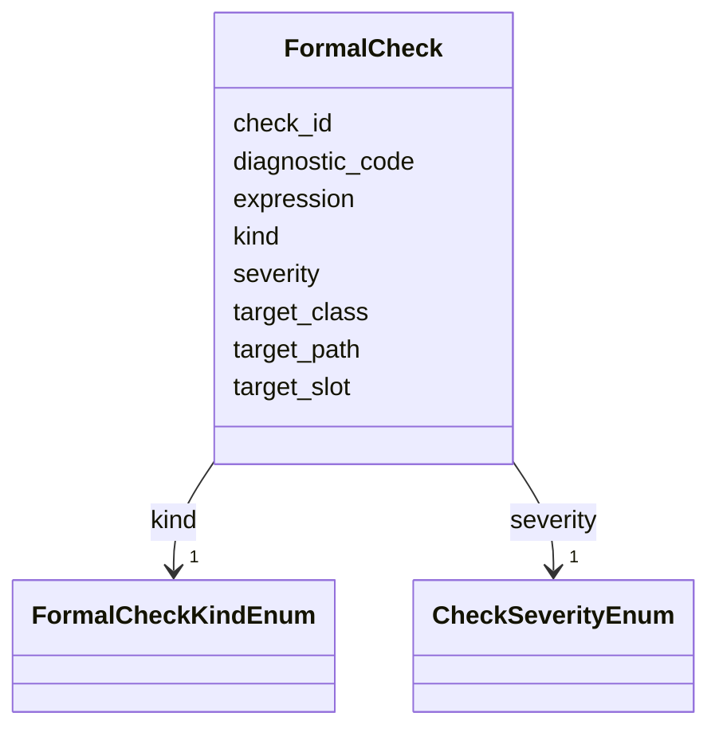

```mermaid
 classDiagram
    class FormalCheck
    click FormalCheck href "../FormalCheck"
      FormalCheck : check_id
        
      FormalCheck : diagnostic_code
        
      FormalCheck : expression
        
      FormalCheck : kind
        
          
    
        
        
        FormalCheck --> "1" FormalCheckKindEnum : kind
        click FormalCheckKindEnum href "../FormalCheckKindEnum"
    

        
      FormalCheck : severity
        
          
    
        
        
        FormalCheck --> "1" CheckSeverityEnum : severity
        click CheckSeverityEnum href "../CheckSeverityEnum"
    

        
      FormalCheck : target_class
        
      FormalCheck : target_path
        
      FormalCheck : target_slot
        
      
```
