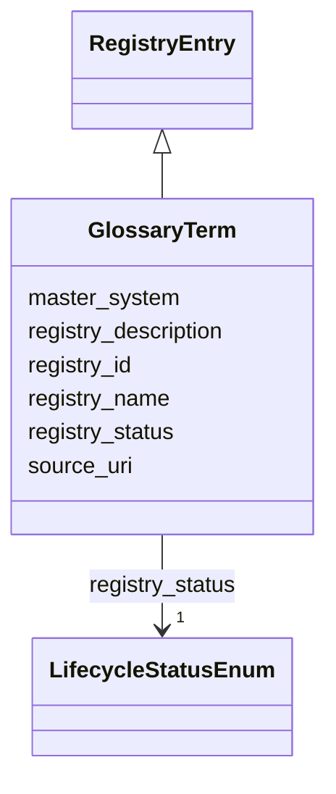

```mermaid
 classDiagram
    class GlossaryTerm
    click GlossaryTerm href "../GlossaryTerm"
      RegistryEntry <|-- GlossaryTerm
        click RegistryEntry href "../RegistryEntry"
      
      GlossaryTerm : master_system
        
      GlossaryTerm : registry_description
        
      GlossaryTerm : registry_id
        
      GlossaryTerm : registry_name
        
      GlossaryTerm : registry_status
        
          
    
        
        
        GlossaryTerm --> "1" LifecycleStatusEnum : registry_status
        click LifecycleStatusEnum href "../LifecycleStatusEnum"
    

        
      GlossaryTerm : source_uri
        
      
```
