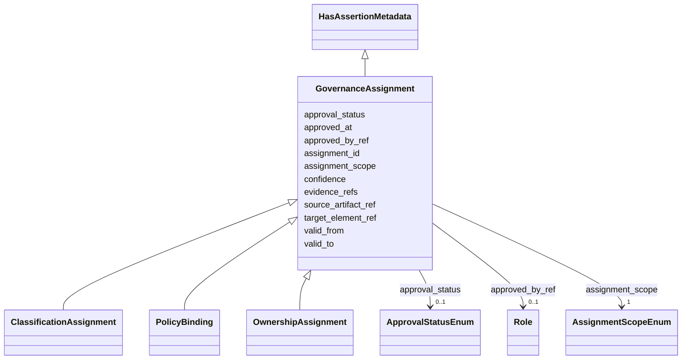

```mermaid
 classDiagram
    class GovernanceAssignment
    click GovernanceAssignment href "../GovernanceAssignment"
      HasAssertionMetadata <|-- GovernanceAssignment
        click HasAssertionMetadata href "../HasAssertionMetadata"
      

      GovernanceAssignment <|-- ClassificationAssignment
        click ClassificationAssignment href "../ClassificationAssignment"
      GovernanceAssignment <|-- PolicyBinding
        click PolicyBinding href "../PolicyBinding"
      GovernanceAssignment <|-- OwnershipAssignment
        click OwnershipAssignment href "../OwnershipAssignment"
      

      GovernanceAssignment : approval_status
        
          
    
        
        
        GovernanceAssignment --> "0..1" ApprovalStatusEnum : approval_status
        click ApprovalStatusEnum href "../ApprovalStatusEnum"
    

        
      GovernanceAssignment : approved_at
        
      GovernanceAssignment : approved_by_ref
        
          
    
        
        
        GovernanceAssignment --> "0..1" Role : approved_by_ref
        click Role href "../Role"
    

        
      GovernanceAssignment : assignment_id
        
      GovernanceAssignment : assignment_scope
        
          
    
        
        
        GovernanceAssignment --> "1" AssignmentScopeEnum : assignment_scope
        click AssignmentScopeEnum href "../AssignmentScopeEnum"
    

        
      GovernanceAssignment : confidence
        
      GovernanceAssignment : evidence_refs
        
      GovernanceAssignment : source_artifact_ref
        
      GovernanceAssignment : target_element_ref
        
      GovernanceAssignment : valid_from
        
      GovernanceAssignment : valid_to
        
      
```
