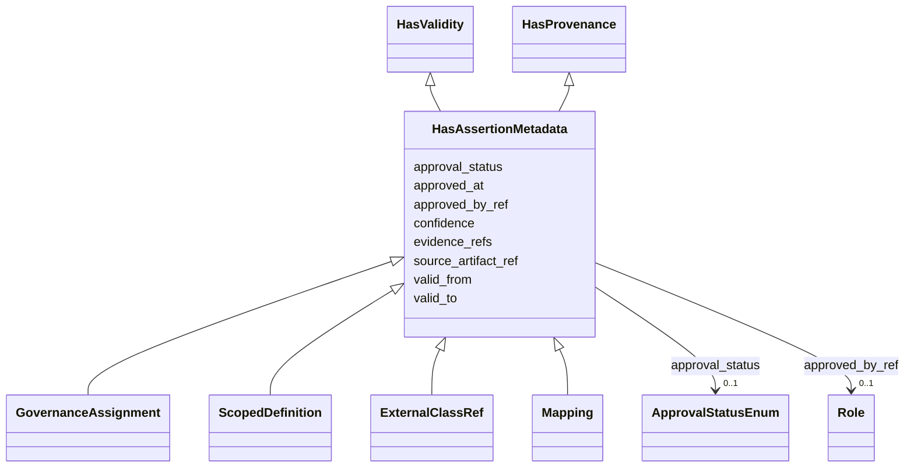

```mermaid
 classDiagram
    class HasAssertionMetadata
    click HasAssertionMetadata href "../HasAssertionMetadata"
      HasValidity <|-- HasAssertionMetadata
        click HasValidity href "../HasValidity"
      HasProvenance <|-- HasAssertionMetadata
        click HasProvenance href "../HasProvenance"
      

      HasAssertionMetadata <|-- GovernanceAssignment
        click GovernanceAssignment href "../GovernanceAssignment"
      HasAssertionMetadata <|-- ScopedDefinition
        click ScopedDefinition href "../ScopedDefinition"
      HasAssertionMetadata <|-- ExternalClassRef
        click ExternalClassRef href "../ExternalClassRef"
      HasAssertionMetadata <|-- Mapping
        click Mapping href "../Mapping"
      

      HasAssertionMetadata : approval_status
        
          
    
        
        
        HasAssertionMetadata --> "0..1" ApprovalStatusEnum : approval_status
        click ApprovalStatusEnum href "../ApprovalStatusEnum"
    

        
      HasAssertionMetadata : approved_at
        
      HasAssertionMetadata : approved_by_ref
        
          
    
        
        
        HasAssertionMetadata --> "0..1" Role : approved_by_ref
        click Role href "../Role"
    

        
      HasAssertionMetadata : confidence
        
      HasAssertionMetadata : evidence_refs
        
      HasAssertionMetadata : source_artifact_ref
        
      HasAssertionMetadata : valid_from
        
      HasAssertionMetadata : valid_to
        
      
```
