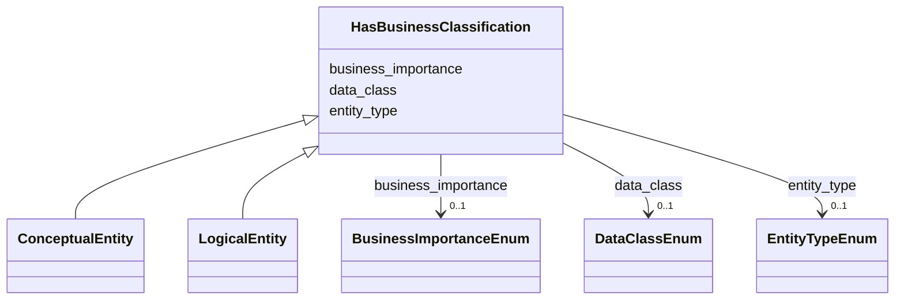

```mermaid
 classDiagram
    class HasBusinessClassification
    click HasBusinessClassification href "../HasBusinessClassification"
      HasBusinessClassification <|-- ConceptualEntity
        click ConceptualEntity href "../ConceptualEntity"
      HasBusinessClassification <|-- LogicalEntity
        click LogicalEntity href "../LogicalEntity"
      
      HasBusinessClassification : business_importance
        
          
    
        
        
        HasBusinessClassification --> "0..1" BusinessImportanceEnum : business_importance
        click BusinessImportanceEnum href "../BusinessImportanceEnum"
    

        
      HasBusinessClassification : data_class
        
          
    
        
        
        HasBusinessClassification --> "0..1" DataClassEnum : data_class
        click DataClassEnum href "../DataClassEnum"
    

        
      HasBusinessClassification : entity_type
        
          
    
        
        
        HasBusinessClassification --> "0..1" EntityTypeEnum : entity_type
        click EntityTypeEnum href "../EntityTypeEnum"
    

        
      
```
