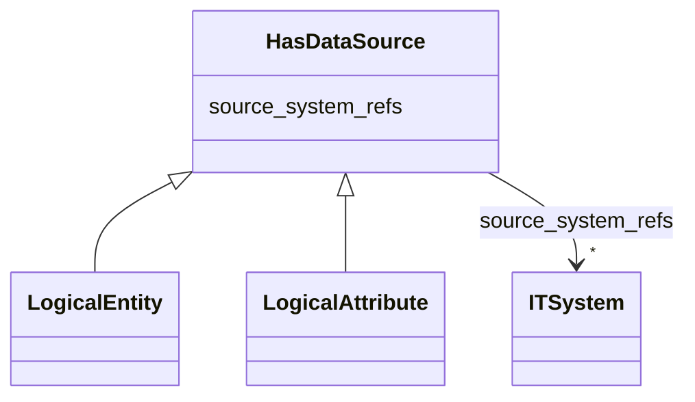

```mermaid
 classDiagram
    class HasDataSource
    click HasDataSource href "../HasDataSource"
      HasDataSource <|-- LogicalEntity
        click LogicalEntity href "../LogicalEntity"
      HasDataSource <|-- LogicalAttribute
        click LogicalAttribute href "../LogicalAttribute"
      
      HasDataSource : source_system_refs
        
          
    
        
        
        HasDataSource --> "*" ITSystem : source_system_refs
        click ITSystem href "../ITSystem"
    

        
      
```
