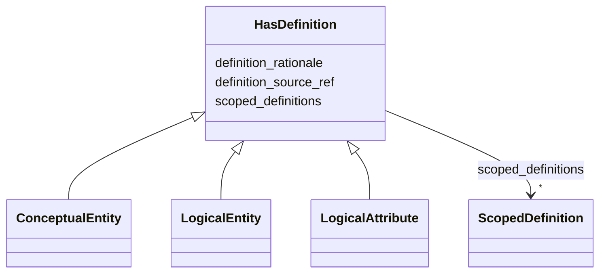

```mermaid
 classDiagram
    class HasDefinition
    click HasDefinition href "../HasDefinition"
      HasDefinition <|-- ConceptualEntity
        click ConceptualEntity href "../ConceptualEntity"
      HasDefinition <|-- LogicalEntity
        click LogicalEntity href "../LogicalEntity"
      HasDefinition <|-- LogicalAttribute
        click LogicalAttribute href "../LogicalAttribute"
      
      HasDefinition : definition_rationale
        
      HasDefinition : definition_source_ref
        
      HasDefinition : scoped_definitions
        
          
    
        
        
        HasDefinition --> "*" ScopedDefinition : scoped_definitions
        click ScopedDefinition href "../ScopedDefinition"
    

        
      
```
