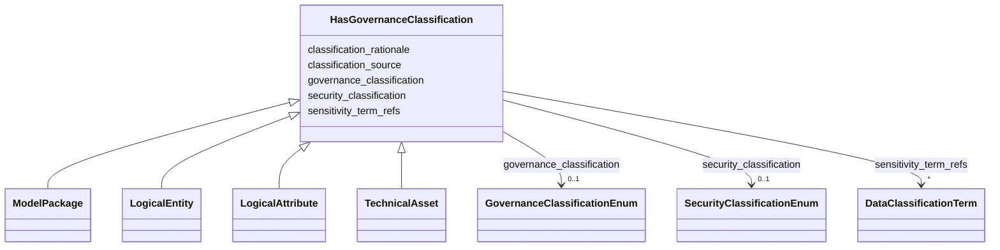

```mermaid
 classDiagram
    class HasGovernanceClassification
    click HasGovernanceClassification href "../HasGovernanceClassification"
      HasGovernanceClassification <|-- ModelPackage
        click ModelPackage href "../ModelPackage"
      HasGovernanceClassification <|-- LogicalEntity
        click LogicalEntity href "../LogicalEntity"
      HasGovernanceClassification <|-- LogicalAttribute
        click LogicalAttribute href "../LogicalAttribute"
      HasGovernanceClassification <|-- TechnicalAsset
        click TechnicalAsset href "../TechnicalAsset"
      
      HasGovernanceClassification : classification_rationale
        
      HasGovernanceClassification : classification_source
        
      HasGovernanceClassification : governance_classification
        
          
    
        
        
        HasGovernanceClassification --> "0..1" GovernanceClassificationEnum : governance_classification
        click GovernanceClassificationEnum href "../GovernanceClassificationEnum"
    

        
      HasGovernanceClassification : security_classification
        
          
    
        
        
        HasGovernanceClassification --> "0..1" SecurityClassificationEnum : security_classification
        click SecurityClassificationEnum href "../SecurityClassificationEnum"
    

        
      HasGovernanceClassification : sensitivity_term_refs
        
          
    
        
        
        HasGovernanceClassification --> "*" DataClassificationTerm : sensitivity_term_refs
        click DataClassificationTerm href "../DataClassificationTerm"
    

        
      
```
