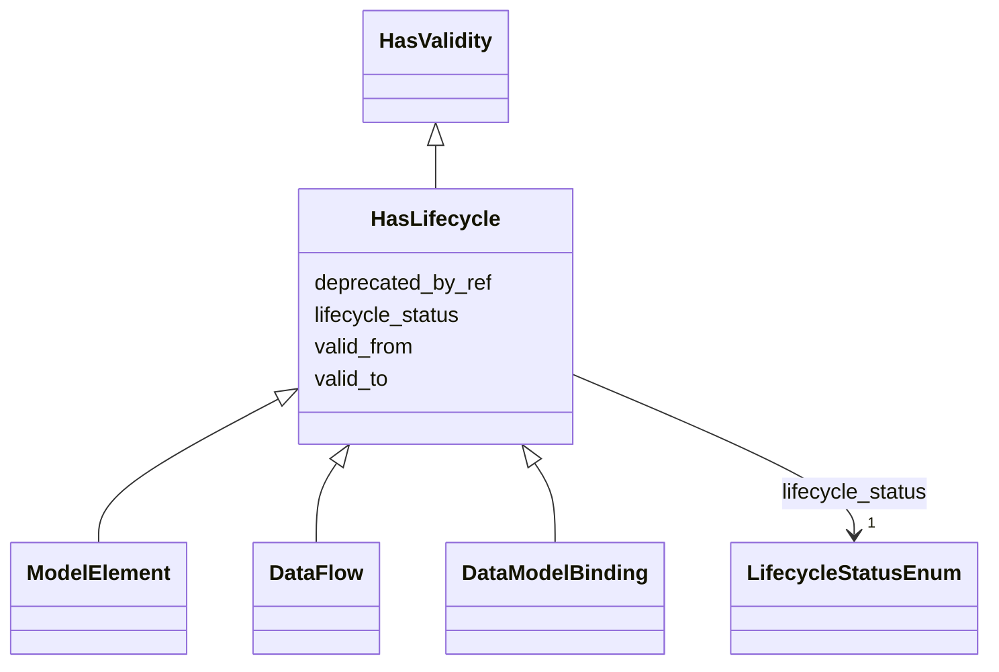

```mermaid
 classDiagram
    class HasLifecycle
    click HasLifecycle href "../HasLifecycle"
      HasValidity <|-- HasLifecycle
        click HasValidity href "../HasValidity"
      

      HasLifecycle <|-- ModelElement
        click ModelElement href "../ModelElement"
      HasLifecycle <|-- DataFlow
        click DataFlow href "../DataFlow"
      HasLifecycle <|-- DataModelBinding
        click DataModelBinding href "../DataModelBinding"
      

      HasLifecycle : deprecated_by_ref
        
      HasLifecycle : lifecycle_status
        
          
    
        
        
        HasLifecycle --> "1" LifecycleStatusEnum : lifecycle_status
        click LifecycleStatusEnum href "../LifecycleStatusEnum"
    

        
      HasLifecycle : valid_from
        
      HasLifecycle : valid_to
        
      
```
