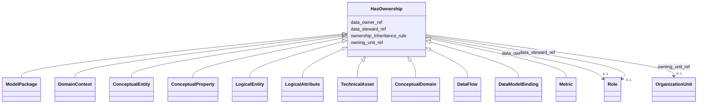

```mermaid
 classDiagram
    class HasOwnership
    click HasOwnership href "../HasOwnership"
      HasOwnership <|-- ModelPackage
        click ModelPackage href "../ModelPackage"
      HasOwnership <|-- DomainContext
        click DomainContext href "../DomainContext"
      HasOwnership <|-- ConceptualEntity
        click ConceptualEntity href "../ConceptualEntity"
      HasOwnership <|-- ConceptualProperty
        click ConceptualProperty href "../ConceptualProperty"
      HasOwnership <|-- LogicalEntity
        click LogicalEntity href "../LogicalEntity"
      HasOwnership <|-- LogicalAttribute
        click LogicalAttribute href "../LogicalAttribute"
      HasOwnership <|-- TechnicalAsset
        click TechnicalAsset href "../TechnicalAsset"
      HasOwnership <|-- ConceptualDomain
        click ConceptualDomain href "../ConceptualDomain"
      HasOwnership <|-- DataFlow
        click DataFlow href "../DataFlow"
      HasOwnership <|-- DataModelBinding
        click DataModelBinding href "../DataModelBinding"
      HasOwnership <|-- Metric
        click Metric href "../Metric"
      
      HasOwnership : data_owner_ref
        
          
    
        
        
        HasOwnership --> "0..1" Role : data_owner_ref
        click Role href "../Role"
    

        
      HasOwnership : data_steward_ref
        
          
    
        
        
        HasOwnership --> "0..1" Role : data_steward_ref
        click Role href "../Role"
    

        
      HasOwnership : ownership_inheritance_rule
        
      HasOwnership : owning_unit_ref
        
          
    
        
        
        HasOwnership --> "0..1" OrganizationUnit : owning_unit_ref
        click OrganizationUnit href "../OrganizationUnit"
    

        
      
```
