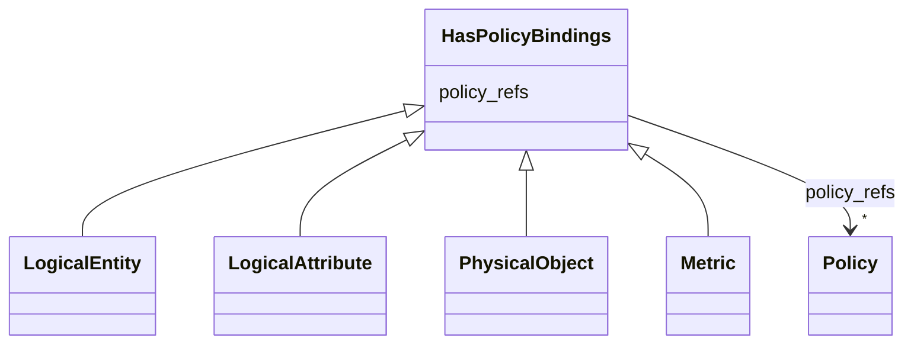

```mermaid
 classDiagram
    class HasPolicyBindings
    click HasPolicyBindings href "../HasPolicyBindings"
      HasPolicyBindings <|-- LogicalEntity
        click LogicalEntity href "../LogicalEntity"
      HasPolicyBindings <|-- LogicalAttribute
        click LogicalAttribute href "../LogicalAttribute"
      HasPolicyBindings <|-- PhysicalObject
        click PhysicalObject href "../PhysicalObject"
      HasPolicyBindings <|-- Metric
        click Metric href "../Metric"
      
      HasPolicyBindings : policy_refs
        
          
    
        
        
        HasPolicyBindings --> "*" Policy : policy_refs
        click Policy href "../Policy"
    

        
      
```
