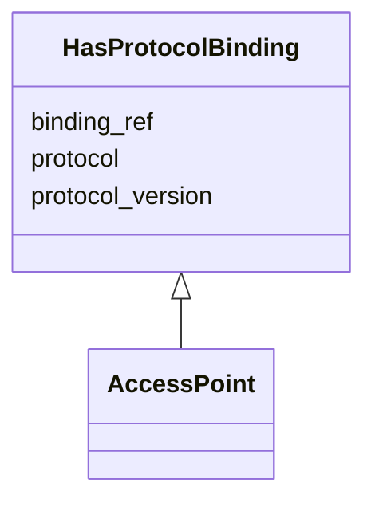

```mermaid
 classDiagram
    class HasProtocolBinding
    click HasProtocolBinding href "../HasProtocolBinding"
      HasProtocolBinding <|-- AccessPoint
        click AccessPoint href "../AccessPoint"
      
      HasProtocolBinding : binding_ref
        
      HasProtocolBinding : protocol
        
      HasProtocolBinding : protocol_version
        
      
```
