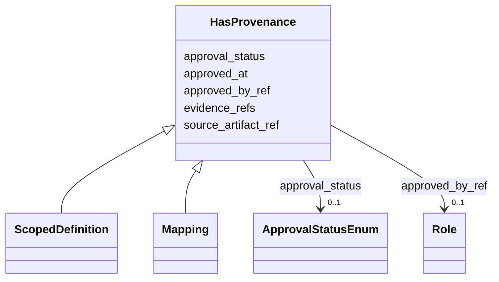

```mermaid
 classDiagram
    class HasProvenance
    click HasProvenance href "../HasProvenance"
      HasProvenance <|-- ScopedDefinition
        click ScopedDefinition href "../ScopedDefinition"
      HasProvenance <|-- Mapping
        click Mapping href "../Mapping"
      
      HasProvenance : approval_status
        
          
    
        
        
        HasProvenance --> "0..1" ApprovalStatusEnum : approval_status
        click ApprovalStatusEnum href "../ApprovalStatusEnum"
    

        
      HasProvenance : approved_at
        
      HasProvenance : approved_by_ref
        
          
    
        
        
        HasProvenance --> "0..1" Role : approved_by_ref
        click Role href "../Role"
    

        
      HasProvenance : evidence_refs
        
      HasProvenance : source_artifact_ref
        
      
```
