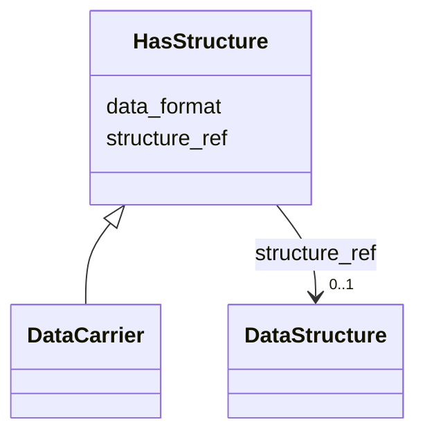

```mermaid
 classDiagram
    class HasStructure
    click HasStructure href "../HasStructure"
      HasStructure <|-- DataCarrier
        click DataCarrier href "../DataCarrier"
      
      HasStructure : data_format
        
      HasStructure : structure_ref
        
          
    
        
        
        HasStructure --> "0..1" DataStructure : structure_ref
        click DataStructure href "../DataStructure"
    

        
      
```
