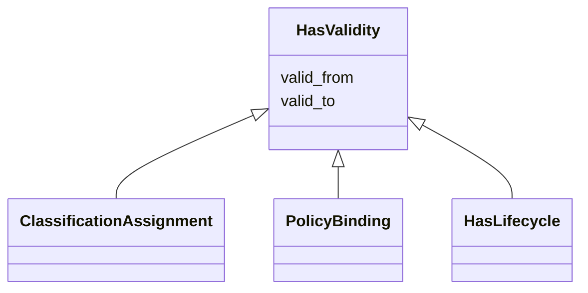

```mermaid
 classDiagram
    class HasValidity
    click HasValidity href "../HasValidity"
      HasValidity <|-- ClassificationAssignment
        click ClassificationAssignment href "../ClassificationAssignment"
      HasValidity <|-- PolicyBinding
        click PolicyBinding href "../PolicyBinding"
      HasValidity <|-- HasLifecycle
        click HasLifecycle href "../HasLifecycle"
      
      HasValidity : valid_from
        
      HasValidity : valid_to
        
      
```
