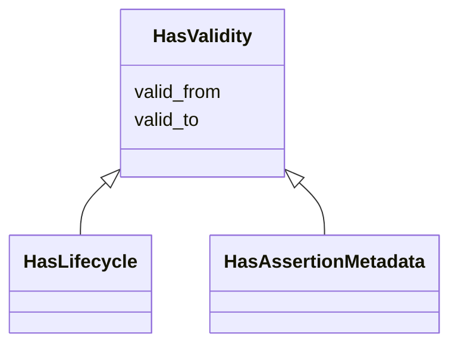

```mermaid
 classDiagram
    class HasValidity
    click HasValidity href "../HasValidity"
      HasValidity <|-- HasLifecycle
        click HasLifecycle href "../HasLifecycle"
      HasValidity <|-- HasAssertionMetadata
        click HasAssertionMetadata href "../HasAssertionMetadata"
      
      HasValidity : valid_from
        
      HasValidity : valid_to
        
      
```
