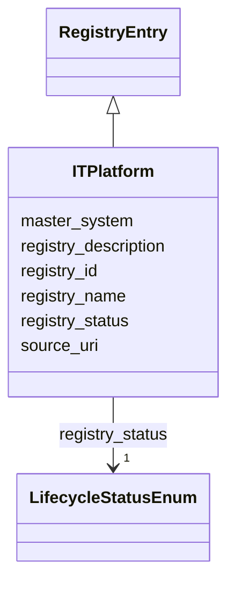

```mermaid
 classDiagram
    class ITPlatform
    click ITPlatform href "../ITPlatform"
      RegistryEntry <|-- ITPlatform
        click RegistryEntry href "../RegistryEntry"
      
      ITPlatform : master_system
        
      ITPlatform : registry_description
        
      ITPlatform : registry_id
        
      ITPlatform : registry_name
        
      ITPlatform : registry_status
        
          
    
        
        
        ITPlatform --> "1" LifecycleStatusEnum : registry_status
        click LifecycleStatusEnum href "../LifecycleStatusEnum"
    

        
      ITPlatform : source_uri
        
      
```
