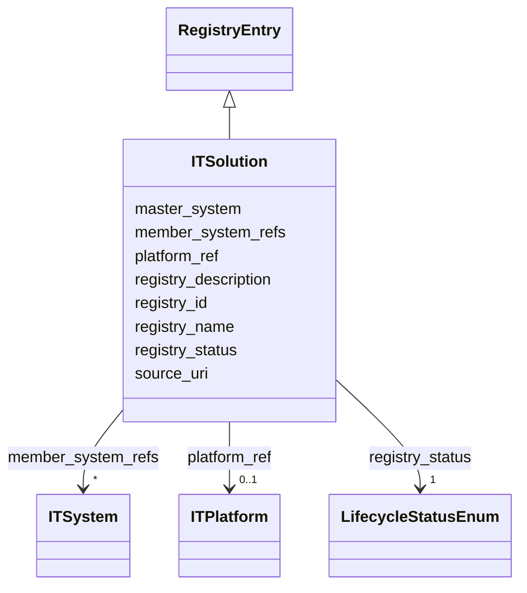

```mermaid
 classDiagram
    class ITSolution
    click ITSolution href "../ITSolution"
      RegistryEntry <|-- ITSolution
        click RegistryEntry href "../RegistryEntry"
      
      ITSolution : master_system
        
      ITSolution : member_system_refs
        
          
    
        
        
        ITSolution --> "*" ITSystem : member_system_refs
        click ITSystem href "../ITSystem"
    

        
      ITSolution : platform_ref
        
          
    
        
        
        ITSolution --> "0..1" ITPlatform : platform_ref
        click ITPlatform href "../ITPlatform"
    

        
      ITSolution : registry_description
        
      ITSolution : registry_id
        
      ITSolution : registry_name
        
      ITSolution : registry_status
        
          
    
        
        
        ITSolution --> "1" LifecycleStatusEnum : registry_status
        click LifecycleStatusEnum href "../LifecycleStatusEnum"
    

        
      ITSolution : source_uri
        
      
```
