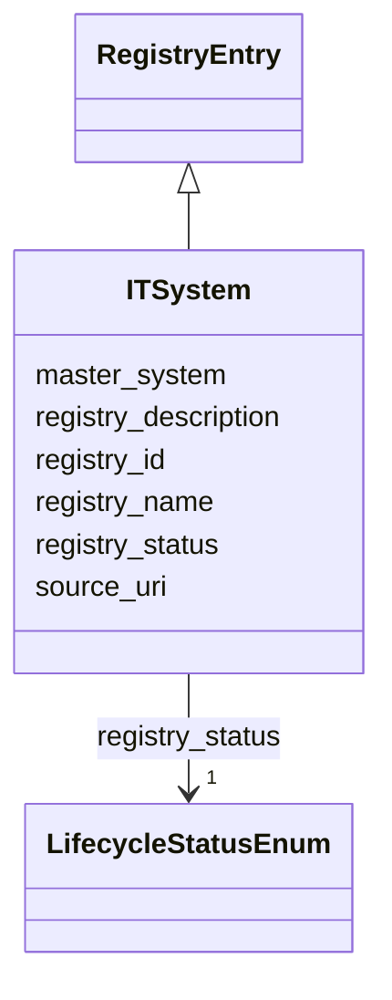

```mermaid
 classDiagram
    class ITSystem
    click ITSystem href "../ITSystem"
      RegistryEntry <|-- ITSystem
        click RegistryEntry href "../RegistryEntry"
      
      ITSystem : master_system
        
      ITSystem : registry_description
        
      ITSystem : registry_id
        
      ITSystem : registry_name
        
      ITSystem : registry_status
        
          
    
        
        
        ITSystem --> "1" LifecycleStatusEnum : registry_status
        click LifecycleStatusEnum href "../LifecycleStatusEnum"
    

        
      ITSystem : source_uri
        
      
```
