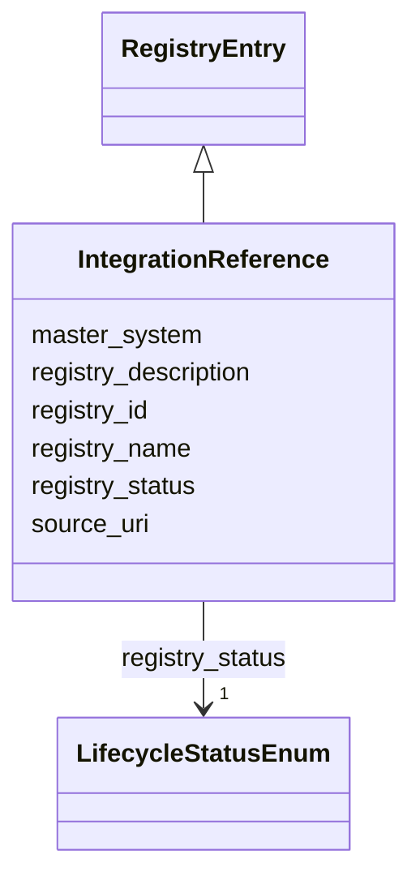

```mermaid
 classDiagram
    class IntegrationReference
    click IntegrationReference href "../IntegrationReference"
      RegistryEntry <|-- IntegrationReference
        click RegistryEntry href "../RegistryEntry"
      
      IntegrationReference : master_system
        
      IntegrationReference : registry_description
        
      IntegrationReference : registry_id
        
      IntegrationReference : registry_name
        
      IntegrationReference : registry_status
        
          
    
        
        
        IntegrationReference --> "1" LifecycleStatusEnum : registry_status
        click LifecycleStatusEnum href "../LifecycleStatusEnum"
    

        
      IntegrationReference : source_uri
        
      
```
