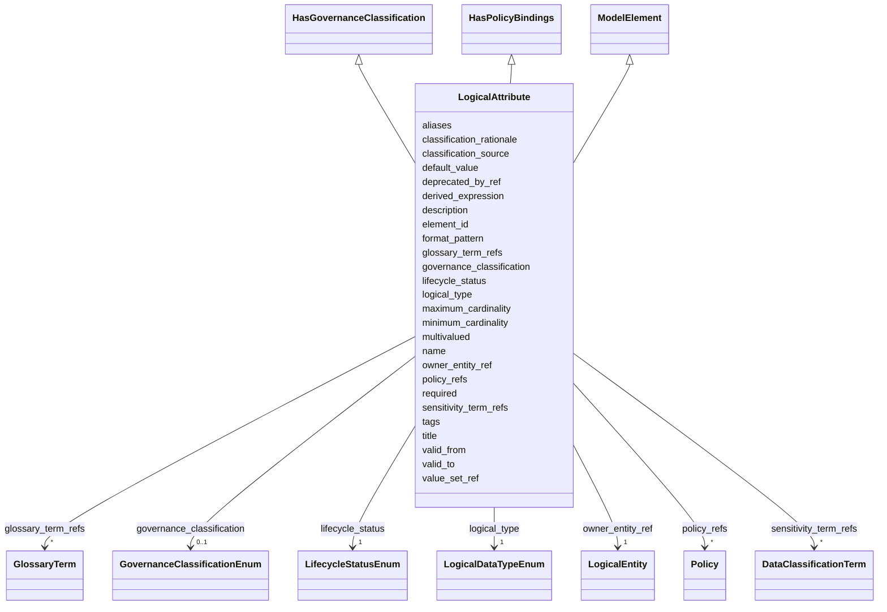

```mermaid
 classDiagram
    class LogicalAttribute
    click LogicalAttribute href "../LogicalAttribute"
      HasGovernanceClassification <|-- LogicalAttribute
        click HasGovernanceClassification href "../HasGovernanceClassification"
      HasPolicyBindings <|-- LogicalAttribute
        click HasPolicyBindings href "../HasPolicyBindings"
      ModelElement <|-- LogicalAttribute
        click ModelElement href "../ModelElement"
      
      LogicalAttribute : aliases
        
      LogicalAttribute : classification_rationale
        
      LogicalAttribute : classification_source
        
      LogicalAttribute : default_value
        
      LogicalAttribute : deprecated_by_ref
        
      LogicalAttribute : derived_expression
        
      LogicalAttribute : description
        
      LogicalAttribute : element_id
        
      LogicalAttribute : format_pattern
        
      LogicalAttribute : glossary_term_refs
        
          
    
        
        
        LogicalAttribute --> "*" GlossaryTerm : glossary_term_refs
        click GlossaryTerm href "../GlossaryTerm"
    

        
      LogicalAttribute : governance_classification
        
          
    
        
        
        LogicalAttribute --> "0..1" GovernanceClassificationEnum : governance_classification
        click GovernanceClassificationEnum href "../GovernanceClassificationEnum"
    

        
      LogicalAttribute : lifecycle_status
        
          
    
        
        
        LogicalAttribute --> "1" LifecycleStatusEnum : lifecycle_status
        click LifecycleStatusEnum href "../LifecycleStatusEnum"
    

        
      LogicalAttribute : logical_type
        
          
    
        
        
        LogicalAttribute --> "1" LogicalDataTypeEnum : logical_type
        click LogicalDataTypeEnum href "../LogicalDataTypeEnum"
    

        
      LogicalAttribute : maximum_cardinality
        
      LogicalAttribute : minimum_cardinality
        
      LogicalAttribute : multivalued
        
      LogicalAttribute : name
        
      LogicalAttribute : owner_entity_ref
        
          
    
        
        
        LogicalAttribute --> "1" LogicalEntity : owner_entity_ref
        click LogicalEntity href "../LogicalEntity"
    

        
      LogicalAttribute : policy_refs
        
          
    
        
        
        LogicalAttribute --> "*" Policy : policy_refs
        click Policy href "../Policy"
    

        
      LogicalAttribute : required
        
      LogicalAttribute : sensitivity_term_refs
        
          
    
        
        
        LogicalAttribute --> "*" DataClassificationTerm : sensitivity_term_refs
        click DataClassificationTerm href "../DataClassificationTerm"
    

        
      LogicalAttribute : tags
        
      LogicalAttribute : title
        
      LogicalAttribute : valid_from
        
      LogicalAttribute : valid_to
        
      LogicalAttribute : value_set_ref
        
      
```
