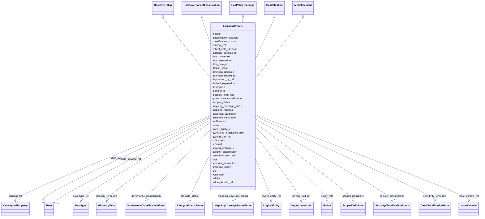

```mermaid
 classDiagram
    class LogicalAttribute
    click LogicalAttribute href "../LogicalAttribute"
      HasOwnership <|-- LogicalAttribute
        click HasOwnership href "../HasOwnership"
      HasGovernanceClassification <|-- LogicalAttribute
        click HasGovernanceClassification href "../HasGovernanceClassification"
      HasPolicyBindings <|-- LogicalAttribute
        click HasPolicyBindings href "../HasPolicyBindings"
      HasDefinition <|-- LogicalAttribute
        click HasDefinition href "../HasDefinition"
      ModelElement <|-- LogicalAttribute
        click ModelElement href "../ModelElement"
      
      LogicalAttribute : aliases
        
      LogicalAttribute : classification_rationale
        
      LogicalAttribute : classification_source
        
      LogicalAttribute : concept_ref
        
          
    
        
        
        LogicalAttribute --> "0..1" ConceptualProperty : concept_ref
        click ConceptualProperty href "../ConceptualProperty"
    

        
      LogicalAttribute : critical_data_element
        
      LogicalAttribute : currency_attribute_ref
        
      LogicalAttribute : data_owner_ref
        
          
    
        
        
        LogicalAttribute --> "0..1" Role : data_owner_ref
        click Role href "../Role"
    

        
      LogicalAttribute : data_steward_ref
        
          
    
        
        
        LogicalAttribute --> "0..1" Role : data_steward_ref
        click Role href "../Role"
    

        
      LogicalAttribute : data_type_ref
        
          
    
        
        
        LogicalAttribute --> "0..1" DataType : data_type_ref
        click DataType href "../DataType"
    

        
      LogicalAttribute : default_value
        
      LogicalAttribute : definition_rationale
        
      LogicalAttribute : definition_source_ref
        
      LogicalAttribute : deprecated_by_ref
        
      LogicalAttribute : derived_expression
        
      LogicalAttribute : description
        
      LogicalAttribute : element_id
        
      LogicalAttribute : glossary_term_refs
        
          
    
        
        
        LogicalAttribute --> "*" GlossaryTerm : glossary_term_refs
        click GlossaryTerm href "../GlossaryTerm"
    

        
      LogicalAttribute : governance_classification
        
          
    
        
        
        LogicalAttribute --> "0..1" GovernanceClassificationEnum : governance_classification
        click GovernanceClassificationEnum href "../GovernanceClassificationEnum"
    

        
      LogicalAttribute : lifecycle_status
        
          
    
        
        
        LogicalAttribute --> "1" LifecycleStatusEnum : lifecycle_status
        click LifecycleStatusEnum href "../LifecycleStatusEnum"
    

        
      LogicalAttribute : mapping_coverage_status
        
          
    
        
        
        LogicalAttribute --> "0..1" MappingCoverageStatusEnum : mapping_coverage_status
        click MappingCoverageStatusEnum href "../MappingCoverageStatusEnum"
    

        
      LogicalAttribute : mapping_rationale
        
      LogicalAttribute : maximum_cardinality
        
      LogicalAttribute : minimum_cardinality
        
      LogicalAttribute : multivalued
        
      LogicalAttribute : name
        
      LogicalAttribute : owner_entity_ref
        
          
    
        
        
        LogicalAttribute --> "1" LogicalEntity : owner_entity_ref
        click LogicalEntity href "../LogicalEntity"
    

        
      LogicalAttribute : ownership_inheritance_rule
        
      LogicalAttribute : owning_unit_ref
        
          
    
        
        
        LogicalAttribute --> "0..1" OrganizationUnit : owning_unit_ref
        click OrganizationUnit href "../OrganizationUnit"
    

        
      LogicalAttribute : policy_refs
        
          
    
        
        
        LogicalAttribute --> "*" Policy : policy_refs
        click Policy href "../Policy"
    

        
      LogicalAttribute : required
        
      LogicalAttribute : scoped_definitions
        
          
    
        
        
        LogicalAttribute --> "*" ScopedDefinition : scoped_definitions
        click ScopedDefinition href "../ScopedDefinition"
    

        
      LogicalAttribute : security_classification
        
          
    
        
        
        LogicalAttribute --> "0..1" SecurityClassificationEnum : security_classification
        click SecurityClassificationEnum href "../SecurityClassificationEnum"
    

        
      LogicalAttribute : sensitivity_term_refs
        
          
    
        
        
        LogicalAttribute --> "*" DataClassificationTerm : sensitivity_term_refs
        click DataClassificationTerm href "../DataClassificationTerm"
    

        
      LogicalAttribute : tags
        
      LogicalAttribute : temporal_semantics
        
      LogicalAttribute : timezone_policy
        
      LogicalAttribute : title
        
      LogicalAttribute : valid_from
        
      LogicalAttribute : valid_to
        
      LogicalAttribute : value_domain_ref
        
          
    
        
        
        LogicalAttribute --> "0..1" ValueDomain : value_domain_ref
        click ValueDomain href "../ValueDomain"
    

        
      
```
