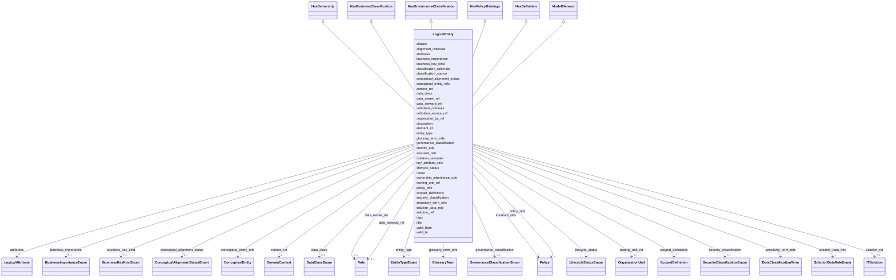

```mermaid
 classDiagram
    class LogicalEntity
    click LogicalEntity href "../LogicalEntity"
      HasOwnership <|-- LogicalEntity
        click HasOwnership href "../HasOwnership"
      HasBusinessClassification <|-- LogicalEntity
        click HasBusinessClassification href "../HasBusinessClassification"
      HasGovernanceClassification <|-- LogicalEntity
        click HasGovernanceClassification href "../HasGovernanceClassification"
      HasPolicyBindings <|-- LogicalEntity
        click HasPolicyBindings href "../HasPolicyBindings"
      HasDefinition <|-- LogicalEntity
        click HasDefinition href "../HasDefinition"
      ModelElement <|-- LogicalEntity
        click ModelElement href "../ModelElement"
      
      LogicalEntity : aliases
        
      LogicalEntity : alignment_rationale
        
      LogicalEntity : attributes
        
          
    
        
        
        LogicalEntity --> "*" LogicalAttribute : attributes
        click LogicalAttribute href "../LogicalAttribute"
    

        
      LogicalEntity : business_importance
        
          
    
        
        
        LogicalEntity --> "0..1" BusinessImportanceEnum : business_importance
        click BusinessImportanceEnum href "../BusinessImportanceEnum"
    

        
      LogicalEntity : business_key_kind
        
          
    
        
        
        LogicalEntity --> "0..1" BusinessKeyKindEnum : business_key_kind
        click BusinessKeyKindEnum href "../BusinessKeyKindEnum"
    

        
      LogicalEntity : classification_rationale
        
      LogicalEntity : classification_source
        
      LogicalEntity : conceptual_alignment_status
        
          
    
        
        
        LogicalEntity --> "0..1" ConceptualAlignmentStatusEnum : conceptual_alignment_status
        click ConceptualAlignmentStatusEnum href "../ConceptualAlignmentStatusEnum"
    

        
      LogicalEntity : conceptual_entity_refs
        
          
    
        
        
        LogicalEntity --> "*" ConceptualEntity : conceptual_entity_refs
        click ConceptualEntity href "../ConceptualEntity"
    

        
      LogicalEntity : context_ref
        
          
    
        
        
        LogicalEntity --> "1" DomainContext : context_ref
        click DomainContext href "../DomainContext"
    

        
      LogicalEntity : data_class
        
          
    
        
        
        LogicalEntity --> "0..1" DataClassEnum : data_class
        click DataClassEnum href "../DataClassEnum"
    

        
      LogicalEntity : data_owner_ref
        
          
    
        
        
        LogicalEntity --> "0..1" Role : data_owner_ref
        click Role href "../Role"
    

        
      LogicalEntity : data_steward_ref
        
          
    
        
        
        LogicalEntity --> "0..1" Role : data_steward_ref
        click Role href "../Role"
    

        
      LogicalEntity : definition_rationale
        
      LogicalEntity : definition_source_ref
        
      LogicalEntity : deprecated_by_ref
        
      LogicalEntity : description
        
      LogicalEntity : element_id
        
      LogicalEntity : entity_type
        
          
    
        
        
        LogicalEntity --> "0..1" EntityTypeEnum : entity_type
        click EntityTypeEnum href "../EntityTypeEnum"
    

        
      LogicalEntity : glossary_term_refs
        
          
    
        
        
        LogicalEntity --> "*" GlossaryTerm : glossary_term_refs
        click GlossaryTerm href "../GlossaryTerm"
    

        
      LogicalEntity : governance_classification
        
          
    
        
        
        LogicalEntity --> "0..1" GovernanceClassificationEnum : governance_classification
        click GovernanceClassificationEnum href "../GovernanceClassificationEnum"
    

        
      LogicalEntity : identity_rule
        
      LogicalEntity : invariant_refs
        
          
    
        
        
        LogicalEntity --> "*" Policy : invariant_refs
        click Policy href "../Policy"
    

        
      LogicalEntity : isolation_rationale
        
      LogicalEntity : key_attribute_refs
        
      LogicalEntity : lifecycle_status
        
          
    
        
        
        LogicalEntity --> "1" LifecycleStatusEnum : lifecycle_status
        click LifecycleStatusEnum href "../LifecycleStatusEnum"
    

        
      LogicalEntity : name
        
      LogicalEntity : ownership_inheritance_rule
        
      LogicalEntity : owning_unit_ref
        
          
    
        
        
        LogicalEntity --> "0..1" OrganizationUnit : owning_unit_ref
        click OrganizationUnit href "../OrganizationUnit"
    

        
      LogicalEntity : policy_refs
        
          
    
        
        
        LogicalEntity --> "*" Policy : policy_refs
        click Policy href "../Policy"
    

        
      LogicalEntity : scoped_definitions
        
          
    
        
        
        LogicalEntity --> "*" ScopedDefinition : scoped_definitions
        click ScopedDefinition href "../ScopedDefinition"
    

        
      LogicalEntity : security_classification
        
          
    
        
        
        LogicalEntity --> "0..1" SecurityClassificationEnum : security_classification
        click SecurityClassificationEnum href "../SecurityClassificationEnum"
    

        
      LogicalEntity : sensitivity_term_refs
        
          
    
        
        
        LogicalEntity --> "*" DataClassificationTerm : sensitivity_term_refs
        click DataClassificationTerm href "../DataClassificationTerm"
    

        
      LogicalEntity : solution_data_role
        
          
    
        
        
        LogicalEntity --> "1" SolutionDataRoleEnum : solution_data_role
        click SolutionDataRoleEnum href "../SolutionDataRoleEnum"
    

        
      LogicalEntity : solution_ref
        
          
    
        
        
        LogicalEntity --> "0..1" ITSolution : solution_ref
        click ITSolution href "../ITSolution"
    

        
      LogicalEntity : tags
        
      LogicalEntity : title
        
      LogicalEntity : valid_from
        
      LogicalEntity : valid_to
        
      
```
