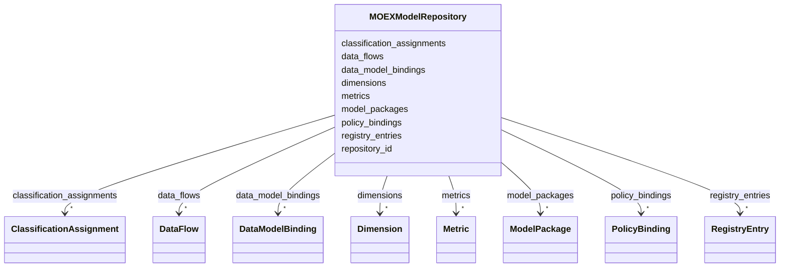

```mermaid
 classDiagram
    class MOEXModelRepository
    click MOEXModelRepository href "../MOEXModelRepository"
      MOEXModelRepository : classification_assignments
        
          
    
        
        
        MOEXModelRepository --> "*" ClassificationAssignment : classification_assignments
        click ClassificationAssignment href "../ClassificationAssignment"
    

        
      MOEXModelRepository : data_flows
        
          
    
        
        
        MOEXModelRepository --> "*" DataFlow : data_flows
        click DataFlow href "../DataFlow"
    

        
      MOEXModelRepository : data_model_bindings
        
          
    
        
        
        MOEXModelRepository --> "*" DataModelBinding : data_model_bindings
        click DataModelBinding href "../DataModelBinding"
    

        
      MOEXModelRepository : dimensions
        
          
    
        
        
        MOEXModelRepository --> "*" Dimension : dimensions
        click Dimension href "../Dimension"
    

        
      MOEXModelRepository : metrics
        
          
    
        
        
        MOEXModelRepository --> "*" Metric : metrics
        click Metric href "../Metric"
    

        
      MOEXModelRepository : model_packages
        
          
    
        
        
        MOEXModelRepository --> "*" ModelPackage : model_packages
        click ModelPackage href "../ModelPackage"
    

        
      MOEXModelRepository : policy_bindings
        
          
    
        
        
        MOEXModelRepository --> "*" PolicyBinding : policy_bindings
        click PolicyBinding href "../PolicyBinding"
    

        
      MOEXModelRepository : registry_entries
        
          
    
        
        
        MOEXModelRepository --> "*" RegistryEntry : registry_entries
        click RegistryEntry href "../RegistryEntry"
    

        
      MOEXModelRepository : repository_id
        
      
```
