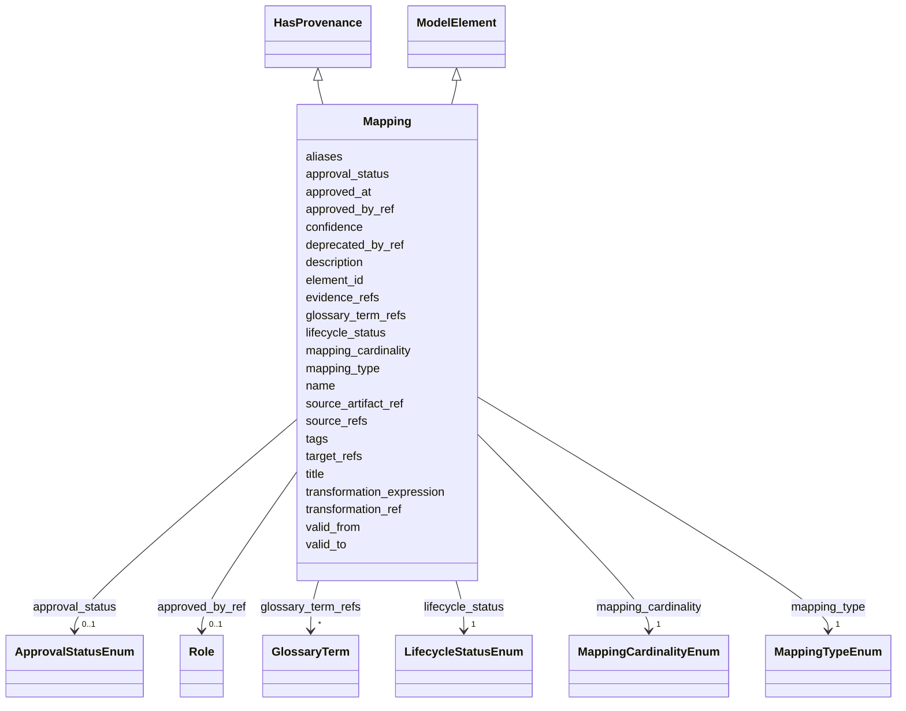

```mermaid
 classDiagram
    class Mapping
    click Mapping href "../Mapping"
      HasProvenance <|-- Mapping
        click HasProvenance href "../HasProvenance"
      ModelElement <|-- Mapping
        click ModelElement href "../ModelElement"
      
      Mapping : aliases
        
      Mapping : approval_status
        
          
    
        
        
        Mapping --> "0..1" ApprovalStatusEnum : approval_status
        click ApprovalStatusEnum href "../ApprovalStatusEnum"
    

        
      Mapping : approved_at
        
      Mapping : approved_by_ref
        
          
    
        
        
        Mapping --> "0..1" Role : approved_by_ref
        click Role href "../Role"
    

        
      Mapping : confidence
        
      Mapping : deprecated_by_ref
        
      Mapping : description
        
      Mapping : element_id
        
      Mapping : evidence_refs
        
      Mapping : glossary_term_refs
        
          
    
        
        
        Mapping --> "*" GlossaryTerm : glossary_term_refs
        click GlossaryTerm href "../GlossaryTerm"
    

        
      Mapping : lifecycle_status
        
          
    
        
        
        Mapping --> "1" LifecycleStatusEnum : lifecycle_status
        click LifecycleStatusEnum href "../LifecycleStatusEnum"
    

        
      Mapping : mapping_cardinality
        
          
    
        
        
        Mapping --> "1" MappingCardinalityEnum : mapping_cardinality
        click MappingCardinalityEnum href "../MappingCardinalityEnum"
    

        
      Mapping : mapping_type
        
          
    
        
        
        Mapping --> "1" MappingTypeEnum : mapping_type
        click MappingTypeEnum href "../MappingTypeEnum"
    

        
      Mapping : name
        
      Mapping : source_artifact_ref
        
      Mapping : source_refs
        
      Mapping : tags
        
      Mapping : target_refs
        
      Mapping : title
        
      Mapping : transformation_expression
        
      Mapping : transformation_ref
        
      Mapping : valid_from
        
      Mapping : valid_to
        
      
```
