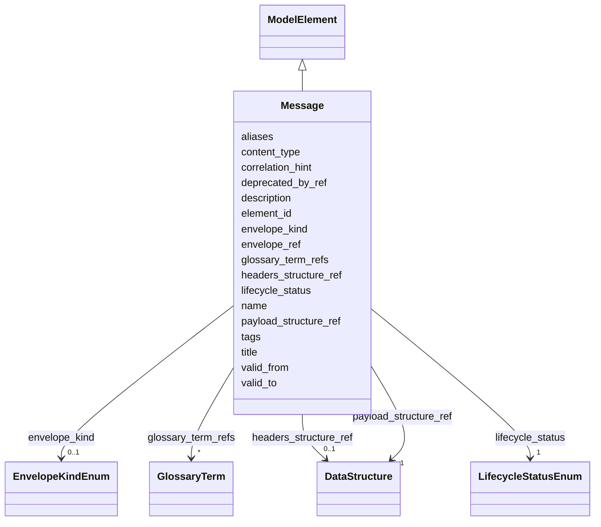

```mermaid
 classDiagram
    class Message
    click Message href "../Message"
      ModelElement <|-- Message
        click ModelElement href "../ModelElement"
      
      Message : aliases
        
      Message : content_type
        
      Message : correlation_hint
        
      Message : deprecated_by_ref
        
      Message : description
        
      Message : element_id
        
      Message : envelope_kind
        
          
    
        
        
        Message --> "0..1" EnvelopeKindEnum : envelope_kind
        click EnvelopeKindEnum href "../EnvelopeKindEnum"
    

        
      Message : envelope_ref
        
      Message : glossary_term_refs
        
          
    
        
        
        Message --> "*" GlossaryTerm : glossary_term_refs
        click GlossaryTerm href "../GlossaryTerm"
    

        
      Message : headers_structure_ref
        
          
    
        
        
        Message --> "0..1" DataStructure : headers_structure_ref
        click DataStructure href "../DataStructure"
    

        
      Message : lifecycle_status
        
          
    
        
        
        Message --> "1" LifecycleStatusEnum : lifecycle_status
        click LifecycleStatusEnum href "../LifecycleStatusEnum"
    

        
      Message : name
        
      Message : payload_structure_ref
        
          
    
        
        
        Message --> "1" DataStructure : payload_structure_ref
        click DataStructure href "../DataStructure"
    

        
      Message : tags
        
      Message : title
        
      Message : valid_from
        
      Message : valid_to
        
      
```
