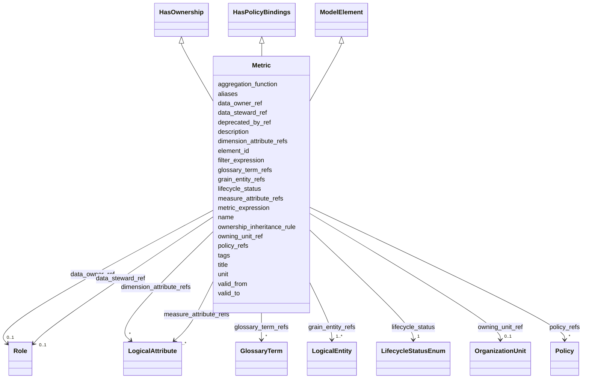

```mermaid
 classDiagram
    class Metric
    click Metric href "../Metric"
      HasOwnership <|-- Metric
        click HasOwnership href "../HasOwnership"
      HasPolicyBindings <|-- Metric
        click HasPolicyBindings href "../HasPolicyBindings"
      ModelElement <|-- Metric
        click ModelElement href "../ModelElement"
      
      Metric : aggregation_function
        
      Metric : aliases
        
      Metric : data_owner_ref
        
          
    
        
        
        Metric --> "0..1" Role : data_owner_ref
        click Role href "../Role"
    

        
      Metric : data_steward_ref
        
          
    
        
        
        Metric --> "0..1" Role : data_steward_ref
        click Role href "../Role"
    

        
      Metric : deprecated_by_ref
        
      Metric : description
        
      Metric : dimension_attribute_refs
        
          
    
        
        
        Metric --> "*" LogicalAttribute : dimension_attribute_refs
        click LogicalAttribute href "../LogicalAttribute"
    

        
      Metric : element_id
        
      Metric : filter_expression
        
      Metric : glossary_term_refs
        
          
    
        
        
        Metric --> "*" GlossaryTerm : glossary_term_refs
        click GlossaryTerm href "../GlossaryTerm"
    

        
      Metric : grain_entity_refs
        
          
    
        
        
        Metric --> "1..*" LogicalEntity : grain_entity_refs
        click LogicalEntity href "../LogicalEntity"
    

        
      Metric : lifecycle_status
        
          
    
        
        
        Metric --> "1" LifecycleStatusEnum : lifecycle_status
        click LifecycleStatusEnum href "../LifecycleStatusEnum"
    

        
      Metric : measure_attribute_refs
        
          
    
        
        
        Metric --> "1..*" LogicalAttribute : measure_attribute_refs
        click LogicalAttribute href "../LogicalAttribute"
    

        
      Metric : metric_expression
        
      Metric : name
        
      Metric : ownership_inheritance_rule
        
      Metric : owning_unit_ref
        
          
    
        
        
        Metric --> "0..1" OrganizationUnit : owning_unit_ref
        click OrganizationUnit href "../OrganizationUnit"
    

        
      Metric : policy_refs
        
          
    
        
        
        Metric --> "*" Policy : policy_refs
        click Policy href "../Policy"
    

        
      Metric : tags
        
      Metric : title
        
      Metric : unit
        
      Metric : valid_from
        
      Metric : valid_to
        
      
```
