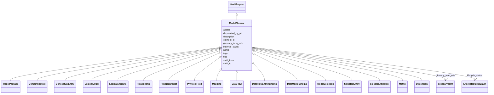

```mermaid
 classDiagram
    class ModelElement
    click ModelElement href "../ModelElement"
      HasLifecycle <|-- ModelElement
        click HasLifecycle href "../HasLifecycle"
      

      ModelElement <|-- ModelPackage
        click ModelPackage href "../ModelPackage"
      ModelElement <|-- DomainContext
        click DomainContext href "../DomainContext"
      ModelElement <|-- ConceptualEntity
        click ConceptualEntity href "../ConceptualEntity"
      ModelElement <|-- LogicalEntity
        click LogicalEntity href "../LogicalEntity"
      ModelElement <|-- LogicalAttribute
        click LogicalAttribute href "../LogicalAttribute"
      ModelElement <|-- Relationship
        click Relationship href "../Relationship"
      ModelElement <|-- PhysicalObject
        click PhysicalObject href "../PhysicalObject"
      ModelElement <|-- PhysicalField
        click PhysicalField href "../PhysicalField"
      ModelElement <|-- Mapping
        click Mapping href "../Mapping"
      ModelElement <|-- DataFlow
        click DataFlow href "../DataFlow"
      ModelElement <|-- DataFlowEntityBinding
        click DataFlowEntityBinding href "../DataFlowEntityBinding"
      ModelElement <|-- DataModelBinding
        click DataModelBinding href "../DataModelBinding"
      ModelElement <|-- ModelSelection
        click ModelSelection href "../ModelSelection"
      ModelElement <|-- SelectedEntity
        click SelectedEntity href "../SelectedEntity"
      ModelElement <|-- SelectedAttribute
        click SelectedAttribute href "../SelectedAttribute"
      ModelElement <|-- Metric
        click Metric href "../Metric"
      ModelElement <|-- Dimension
        click Dimension href "../Dimension"
      

      ModelElement : aliases
        
      ModelElement : deprecated_by_ref
        
      ModelElement : description
        
      ModelElement : element_id
        
      ModelElement : glossary_term_refs
        
          
    
        
        
        ModelElement --> "*" GlossaryTerm : glossary_term_refs
        click GlossaryTerm href "../GlossaryTerm"
    

        
      ModelElement : lifecycle_status
        
          
    
        
        
        ModelElement --> "1" LifecycleStatusEnum : lifecycle_status
        click LifecycleStatusEnum href "../LifecycleStatusEnum"
    

        
      ModelElement : name
        
      ModelElement : tags
        
      ModelElement : title
        
      ModelElement : valid_from
        
      ModelElement : valid_to
        
      
```
