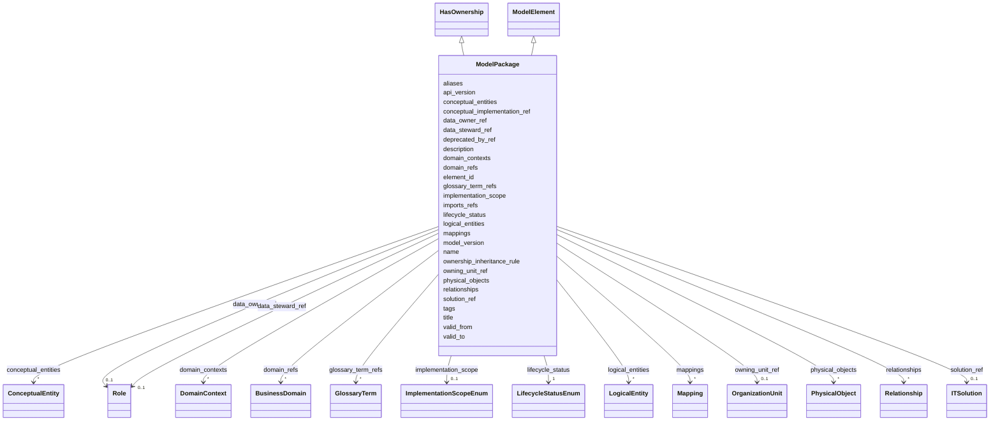

```mermaid
 classDiagram
    class ModelPackage
    click ModelPackage href "../ModelPackage"
      HasOwnership <|-- ModelPackage
        click HasOwnership href "../HasOwnership"
      ModelElement <|-- ModelPackage
        click ModelElement href "../ModelElement"
      
      ModelPackage : aliases
        
      ModelPackage : api_version
        
      ModelPackage : conceptual_entities
        
          
    
        
        
        ModelPackage --> "*" ConceptualEntity : conceptual_entities
        click ConceptualEntity href "../ConceptualEntity"
    

        
      ModelPackage : conceptual_implementation_ref
        
      ModelPackage : data_owner_ref
        
          
    
        
        
        ModelPackage --> "0..1" Role : data_owner_ref
        click Role href "../Role"
    

        
      ModelPackage : data_steward_ref
        
          
    
        
        
        ModelPackage --> "0..1" Role : data_steward_ref
        click Role href "../Role"
    

        
      ModelPackage : deprecated_by_ref
        
      ModelPackage : description
        
      ModelPackage : domain_contexts
        
          
    
        
        
        ModelPackage --> "*" DomainContext : domain_contexts
        click DomainContext href "../DomainContext"
    

        
      ModelPackage : domain_refs
        
          
    
        
        
        ModelPackage --> "*" BusinessDomain : domain_refs
        click BusinessDomain href "../BusinessDomain"
    

        
      ModelPackage : element_id
        
      ModelPackage : glossary_term_refs
        
          
    
        
        
        ModelPackage --> "*" GlossaryTerm : glossary_term_refs
        click GlossaryTerm href "../GlossaryTerm"
    

        
      ModelPackage : implementation_scope
        
          
    
        
        
        ModelPackage --> "0..1" ImplementationScopeEnum : implementation_scope
        click ImplementationScopeEnum href "../ImplementationScopeEnum"
    

        
      ModelPackage : imports_refs
        
      ModelPackage : lifecycle_status
        
          
    
        
        
        ModelPackage --> "1" LifecycleStatusEnum : lifecycle_status
        click LifecycleStatusEnum href "../LifecycleStatusEnum"
    

        
      ModelPackage : logical_entities
        
          
    
        
        
        ModelPackage --> "*" LogicalEntity : logical_entities
        click LogicalEntity href "../LogicalEntity"
    

        
      ModelPackage : mappings
        
          
    
        
        
        ModelPackage --> "*" Mapping : mappings
        click Mapping href "../Mapping"
    

        
      ModelPackage : model_version
        
      ModelPackage : name
        
      ModelPackage : ownership_inheritance_rule
        
      ModelPackage : owning_unit_ref
        
          
    
        
        
        ModelPackage --> "0..1" OrganizationUnit : owning_unit_ref
        click OrganizationUnit href "../OrganizationUnit"
    

        
      ModelPackage : physical_objects
        
          
    
        
        
        ModelPackage --> "*" PhysicalObject : physical_objects
        click PhysicalObject href "../PhysicalObject"
    

        
      ModelPackage : relationships
        
          
    
        
        
        ModelPackage --> "*" Relationship : relationships
        click Relationship href "../Relationship"
    

        
      ModelPackage : solution_ref
        
          
    
        
        
        ModelPackage --> "0..1" ITSolution : solution_ref
        click ITSolution href "../ITSolution"
    

        
      ModelPackage : tags
        
      ModelPackage : title
        
      ModelPackage : valid_from
        
      ModelPackage : valid_to
        
      
```
