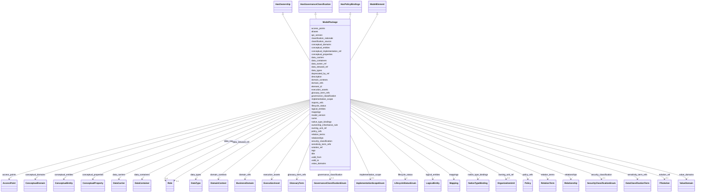

```mermaid
 classDiagram
    class ModelPackage
    click ModelPackage href "../ModelPackage"
      HasOwnership <|-- ModelPackage
        click HasOwnership href "../HasOwnership"
      HasGovernanceClassification <|-- ModelPackage
        click HasGovernanceClassification href "../HasGovernanceClassification"
      HasPolicyBindings <|-- ModelPackage
        click HasPolicyBindings href "../HasPolicyBindings"
      ModelElement <|-- ModelPackage
        click ModelElement href "../ModelElement"
      
      ModelPackage : access_points
        
          
    
        
        
        ModelPackage --> "*" AccessPoint : access_points
        click AccessPoint href "../AccessPoint"
    

        
      ModelPackage : aliases
        
      ModelPackage : api_version
        
      ModelPackage : classification_rationale
        
      ModelPackage : classification_source
        
      ModelPackage : conceptual_domains
        
          
    
        
        
        ModelPackage --> "*" ConceptualDomain : conceptual_domains
        click ConceptualDomain href "../ConceptualDomain"
    

        
      ModelPackage : conceptual_entities
        
          
    
        
        
        ModelPackage --> "*" ConceptualEntity : conceptual_entities
        click ConceptualEntity href "../ConceptualEntity"
    

        
      ModelPackage : conceptual_implementation_ref
        
      ModelPackage : conceptual_properties
        
          
    
        
        
        ModelPackage --> "*" ConceptualProperty : conceptual_properties
        click ConceptualProperty href "../ConceptualProperty"
    

        
      ModelPackage : data_carriers
        
          
    
        
        
        ModelPackage --> "*" DataCarrier : data_carriers
        click DataCarrier href "../DataCarrier"
    

        
      ModelPackage : data_containers
        
          
    
        
        
        ModelPackage --> "*" DataContainer : data_containers
        click DataContainer href "../DataContainer"
    

        
      ModelPackage : data_owner_ref
        
          
    
        
        
        ModelPackage --> "0..1" Role : data_owner_ref
        click Role href "../Role"
    

        
      ModelPackage : data_steward_ref
        
          
    
        
        
        ModelPackage --> "0..1" Role : data_steward_ref
        click Role href "../Role"
    

        
      ModelPackage : data_types
        
          
    
        
        
        ModelPackage --> "*" DataType : data_types
        click DataType href "../DataType"
    

        
      ModelPackage : deprecated_by_ref
        
      ModelPackage : description
        
      ModelPackage : domain_contexts
        
          
    
        
        
        ModelPackage --> "*" DomainContext : domain_contexts
        click DomainContext href "../DomainContext"
    

        
      ModelPackage : domain_refs
        
          
    
        
        
        ModelPackage --> "*" BusinessDomain : domain_refs
        click BusinessDomain href "../BusinessDomain"
    

        
      ModelPackage : element_id
        
      ModelPackage : execution_assets
        
          
    
        
        
        ModelPackage --> "*" ExecutionAsset : execution_assets
        click ExecutionAsset href "../ExecutionAsset"
    

        
      ModelPackage : glossary_term_refs
        
          
    
        
        
        ModelPackage --> "*" GlossaryTerm : glossary_term_refs
        click GlossaryTerm href "../GlossaryTerm"
    

        
      ModelPackage : governance_classification
        
          
    
        
        
        ModelPackage --> "0..1" GovernanceClassificationEnum : governance_classification
        click GovernanceClassificationEnum href "../GovernanceClassificationEnum"
    

        
      ModelPackage : implementation_scope
        
          
    
        
        
        ModelPackage --> "0..1" ImplementationScopeEnum : implementation_scope
        click ImplementationScopeEnum href "../ImplementationScopeEnum"
    

        
      ModelPackage : imports_refs
        
      ModelPackage : lifecycle_status
        
          
    
        
        
        ModelPackage --> "1" LifecycleStatusEnum : lifecycle_status
        click LifecycleStatusEnum href "../LifecycleStatusEnum"
    

        
      ModelPackage : logical_entities
        
          
    
        
        
        ModelPackage --> "*" LogicalEntity : logical_entities
        click LogicalEntity href "../LogicalEntity"
    

        
      ModelPackage : mappings
        
          
    
        
        
        ModelPackage --> "*" Mapping : mappings
        click Mapping href "../Mapping"
    

        
      ModelPackage : model_version
        
      ModelPackage : name
        
      ModelPackage : native_type_bindings
        
          
    
        
        
        ModelPackage --> "*" NativeTypeBinding : native_type_bindings
        click NativeTypeBinding href "../NativeTypeBinding"
    

        
      ModelPackage : ownership_inheritance_rule
        
      ModelPackage : owning_unit_ref
        
          
    
        
        
        ModelPackage --> "0..1" OrganizationUnit : owning_unit_ref
        click OrganizationUnit href "../OrganizationUnit"
    

        
      ModelPackage : policy_refs
        
          
    
        
        
        ModelPackage --> "*" Policy : policy_refs
        click Policy href "../Policy"
    

        
      ModelPackage : relation_terms
        
          
    
        
        
        ModelPackage --> "*" RelationTerm : relation_terms
        click RelationTerm href "../RelationTerm"
    

        
      ModelPackage : relationships
        
          
    
        
        
        ModelPackage --> "*" Relationship : relationships
        click Relationship href "../Relationship"
    

        
      ModelPackage : security_classification
        
          
    
        
        
        ModelPackage --> "0..1" SecurityClassificationEnum : security_classification
        click SecurityClassificationEnum href "../SecurityClassificationEnum"
    

        
      ModelPackage : sensitivity_term_refs
        
          
    
        
        
        ModelPackage --> "*" DataClassificationTerm : sensitivity_term_refs
        click DataClassificationTerm href "../DataClassificationTerm"
    

        
      ModelPackage : solution_ref
        
          
    
        
        
        ModelPackage --> "0..1" ITSolution : solution_ref
        click ITSolution href "../ITSolution"
    

        
      ModelPackage : tags
        
      ModelPackage : title
        
      ModelPackage : valid_from
        
      ModelPackage : valid_to
        
      ModelPackage : value_domains
        
          
    
        
        
        ModelPackage --> "*" ValueDomain : value_domains
        click ValueDomain href "../ValueDomain"
    

        
      
```
