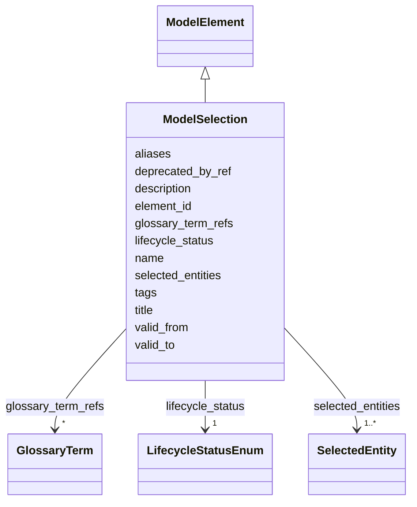

```mermaid
 classDiagram
    class ModelSelection
    click ModelSelection href "../ModelSelection"
      ModelElement <|-- ModelSelection
        click ModelElement href "../ModelElement"
      
      ModelSelection : aliases
        
      ModelSelection : deprecated_by_ref
        
      ModelSelection : description
        
      ModelSelection : element_id
        
      ModelSelection : glossary_term_refs
        
          
    
        
        
        ModelSelection --> "*" GlossaryTerm : glossary_term_refs
        click GlossaryTerm href "../GlossaryTerm"
    

        
      ModelSelection : lifecycle_status
        
          
    
        
        
        ModelSelection --> "1" LifecycleStatusEnum : lifecycle_status
        click LifecycleStatusEnum href "../LifecycleStatusEnum"
    

        
      ModelSelection : name
        
      ModelSelection : selected_entities
        
          
    
        
        
        ModelSelection --> "1..*" SelectedEntity : selected_entities
        click SelectedEntity href "../SelectedEntity"
    

        
      ModelSelection : tags
        
      ModelSelection : title
        
      ModelSelection : valid_from
        
      ModelSelection : valid_to
        
      
```
