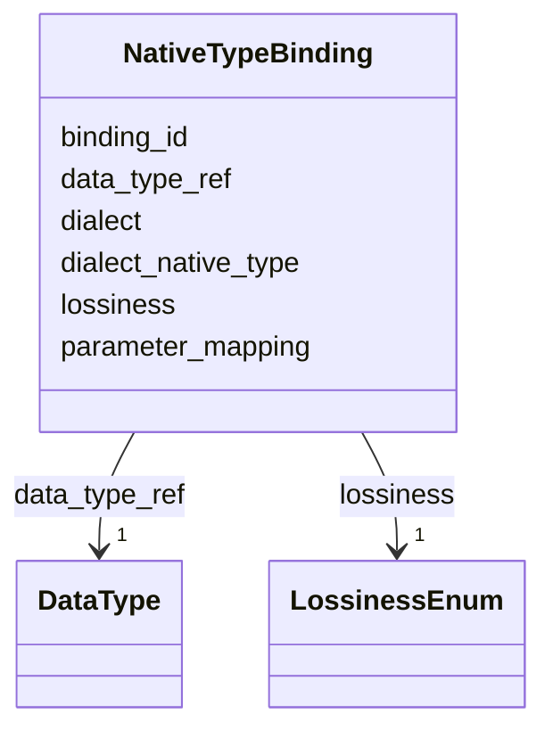

```mermaid
 classDiagram
    class NativeTypeBinding
    click NativeTypeBinding href "../NativeTypeBinding"
      NativeTypeBinding : binding_id
        
      NativeTypeBinding : data_type_ref
        
          
    
        
        
        NativeTypeBinding --> "1" DataType : data_type_ref
        click DataType href "../DataType"
    

        
      NativeTypeBinding : dialect
        
      NativeTypeBinding : dialect_native_type
        
      NativeTypeBinding : lossiness
        
          
    
        
        
        NativeTypeBinding --> "1" LossinessEnum : lossiness
        click LossinessEnum href "../LossinessEnum"
    

        
      NativeTypeBinding : parameter_mapping
        
      
```
