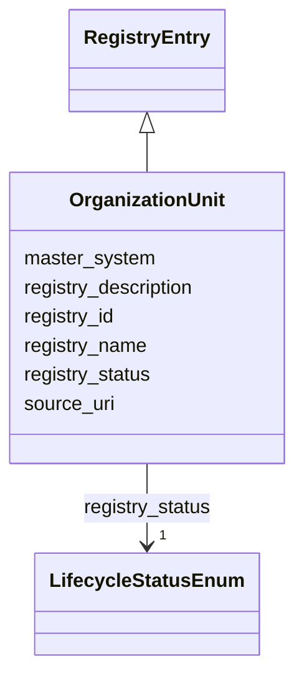

```mermaid
 classDiagram
    class OrganizationUnit
    click OrganizationUnit href "../OrganizationUnit"
      RegistryEntry <|-- OrganizationUnit
        click RegistryEntry href "../RegistryEntry"
      
      OrganizationUnit : master_system
        
      OrganizationUnit : registry_description
        
      OrganizationUnit : registry_id
        
      OrganizationUnit : registry_name
        
      OrganizationUnit : registry_status
        
          
    
        
        
        OrganizationUnit --> "1" LifecycleStatusEnum : registry_status
        click LifecycleStatusEnum href "../LifecycleStatusEnum"
    

        
      OrganizationUnit : source_uri
        
      
```
