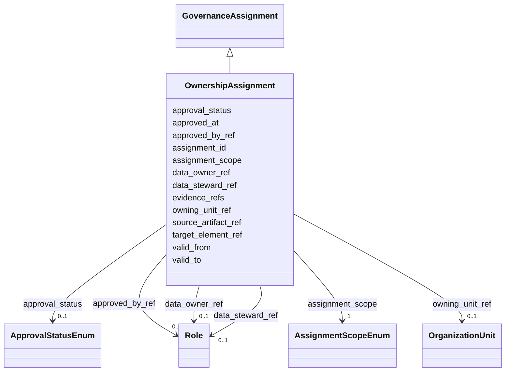

```mermaid
 classDiagram
    class OwnershipAssignment
    click OwnershipAssignment href "../OwnershipAssignment"
      GovernanceAssignment <|-- OwnershipAssignment
        click GovernanceAssignment href "../GovernanceAssignment"
      
      OwnershipAssignment : approval_status
        
          
    
        
        
        OwnershipAssignment --> "0..1" ApprovalStatusEnum : approval_status
        click ApprovalStatusEnum href "../ApprovalStatusEnum"
    

        
      OwnershipAssignment : approved_at
        
      OwnershipAssignment : approved_by_ref
        
          
    
        
        
        OwnershipAssignment --> "0..1" Role : approved_by_ref
        click Role href "../Role"
    

        
      OwnershipAssignment : assignment_id
        
      OwnershipAssignment : assignment_scope
        
          
    
        
        
        OwnershipAssignment --> "1" AssignmentScopeEnum : assignment_scope
        click AssignmentScopeEnum href "../AssignmentScopeEnum"
    

        
      OwnershipAssignment : data_owner_ref
        
          
    
        
        
        OwnershipAssignment --> "0..1" Role : data_owner_ref
        click Role href "../Role"
    

        
      OwnershipAssignment : data_steward_ref
        
          
    
        
        
        OwnershipAssignment --> "0..1" Role : data_steward_ref
        click Role href "../Role"
    

        
      OwnershipAssignment : evidence_refs
        
      OwnershipAssignment : owning_unit_ref
        
          
    
        
        
        OwnershipAssignment --> "0..1" OrganizationUnit : owning_unit_ref
        click OrganizationUnit href "../OrganizationUnit"
    

        
      OwnershipAssignment : source_artifact_ref
        
      OwnershipAssignment : target_element_ref
        
      OwnershipAssignment : valid_from
        
      OwnershipAssignment : valid_to
        
      
```
