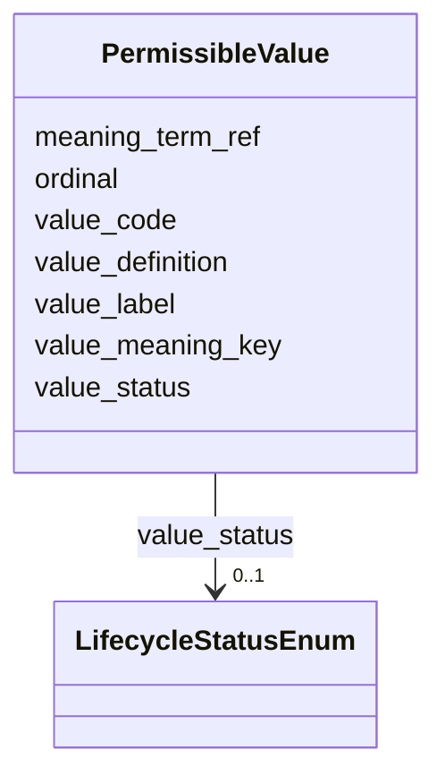

```mermaid
 classDiagram
    class PermissibleValue
    click PermissibleValue href "../PermissibleValue"
      PermissibleValue : meaning_term_ref
        
      PermissibleValue : ordinal
        
      PermissibleValue : value_code
        
      PermissibleValue : value_definition
        
      PermissibleValue : value_label
        
      PermissibleValue : value_meaning_key
        
      PermissibleValue : value_status
        
          
    
        
        
        PermissibleValue --> "0..1" LifecycleStatusEnum : value_status
        click LifecycleStatusEnum href "../LifecycleStatusEnum"
    

        
      
```
