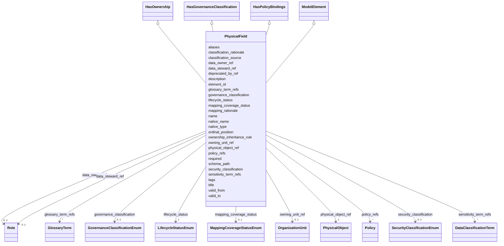

```mermaid
 classDiagram
    class PhysicalField
    click PhysicalField href "../PhysicalField"
      HasOwnership <|-- PhysicalField
        click HasOwnership href "../HasOwnership"
      HasGovernanceClassification <|-- PhysicalField
        click HasGovernanceClassification href "../HasGovernanceClassification"
      HasPolicyBindings <|-- PhysicalField
        click HasPolicyBindings href "../HasPolicyBindings"
      ModelElement <|-- PhysicalField
        click ModelElement href "../ModelElement"
      
      PhysicalField : aliases
        
      PhysicalField : classification_rationale
        
      PhysicalField : classification_source
        
      PhysicalField : data_owner_ref
        
          
    
        
        
        PhysicalField --> "0..1" Role : data_owner_ref
        click Role href "../Role"
    

        
      PhysicalField : data_steward_ref
        
          
    
        
        
        PhysicalField --> "0..1" Role : data_steward_ref
        click Role href "../Role"
    

        
      PhysicalField : deprecated_by_ref
        
      PhysicalField : description
        
      PhysicalField : element_id
        
      PhysicalField : glossary_term_refs
        
          
    
        
        
        PhysicalField --> "*" GlossaryTerm : glossary_term_refs
        click GlossaryTerm href "../GlossaryTerm"
    

        
      PhysicalField : governance_classification
        
          
    
        
        
        PhysicalField --> "0..1" GovernanceClassificationEnum : governance_classification
        click GovernanceClassificationEnum href "../GovernanceClassificationEnum"
    

        
      PhysicalField : lifecycle_status
        
          
    
        
        
        PhysicalField --> "1" LifecycleStatusEnum : lifecycle_status
        click LifecycleStatusEnum href "../LifecycleStatusEnum"
    

        
      PhysicalField : mapping_coverage_status
        
          
    
        
        
        PhysicalField --> "0..1" MappingCoverageStatusEnum : mapping_coverage_status
        click MappingCoverageStatusEnum href "../MappingCoverageStatusEnum"
    

        
      PhysicalField : mapping_rationale
        
      PhysicalField : name
        
      PhysicalField : native_name
        
      PhysicalField : native_type
        
      PhysicalField : ordinal_position
        
      PhysicalField : ownership_inheritance_rule
        
      PhysicalField : owning_unit_ref
        
          
    
        
        
        PhysicalField --> "0..1" OrganizationUnit : owning_unit_ref
        click OrganizationUnit href "../OrganizationUnit"
    

        
      PhysicalField : physical_object_ref
        
          
    
        
        
        PhysicalField --> "1" PhysicalObject : physical_object_ref
        click PhysicalObject href "../PhysicalObject"
    

        
      PhysicalField : policy_refs
        
          
    
        
        
        PhysicalField --> "*" Policy : policy_refs
        click Policy href "../Policy"
    

        
      PhysicalField : required
        
      PhysicalField : schema_path
        
      PhysicalField : security_classification
        
          
    
        
        
        PhysicalField --> "0..1" SecurityClassificationEnum : security_classification
        click SecurityClassificationEnum href "../SecurityClassificationEnum"
    

        
      PhysicalField : sensitivity_term_refs
        
          
    
        
        
        PhysicalField --> "*" DataClassificationTerm : sensitivity_term_refs
        click DataClassificationTerm href "../DataClassificationTerm"
    

        
      PhysicalField : tags
        
      PhysicalField : title
        
      PhysicalField : valid_from
        
      PhysicalField : valid_to
        
      
```
