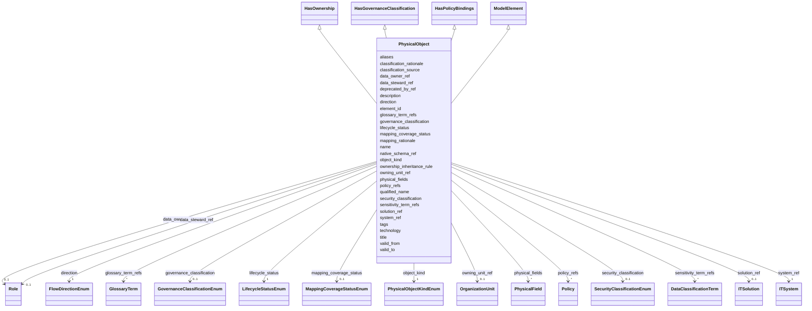

```mermaid
 classDiagram
    class PhysicalObject
    click PhysicalObject href "../PhysicalObject"
      HasOwnership <|-- PhysicalObject
        click HasOwnership href "../HasOwnership"
      HasGovernanceClassification <|-- PhysicalObject
        click HasGovernanceClassification href "../HasGovernanceClassification"
      HasPolicyBindings <|-- PhysicalObject
        click HasPolicyBindings href "../HasPolicyBindings"
      ModelElement <|-- PhysicalObject
        click ModelElement href "../ModelElement"
      
      PhysicalObject : aliases
        
      PhysicalObject : classification_rationale
        
      PhysicalObject : classification_source
        
      PhysicalObject : data_owner_ref
        
          
    
        
        
        PhysicalObject --> "0..1" Role : data_owner_ref
        click Role href "../Role"
    

        
      PhysicalObject : data_steward_ref
        
          
    
        
        
        PhysicalObject --> "0..1" Role : data_steward_ref
        click Role href "../Role"
    

        
      PhysicalObject : deprecated_by_ref
        
      PhysicalObject : description
        
      PhysicalObject : direction
        
          
    
        
        
        PhysicalObject --> "1" FlowDirectionEnum : direction
        click FlowDirectionEnum href "../FlowDirectionEnum"
    

        
      PhysicalObject : element_id
        
      PhysicalObject : glossary_term_refs
        
          
    
        
        
        PhysicalObject --> "*" GlossaryTerm : glossary_term_refs
        click GlossaryTerm href "../GlossaryTerm"
    

        
      PhysicalObject : governance_classification
        
          
    
        
        
        PhysicalObject --> "0..1" GovernanceClassificationEnum : governance_classification
        click GovernanceClassificationEnum href "../GovernanceClassificationEnum"
    

        
      PhysicalObject : lifecycle_status
        
          
    
        
        
        PhysicalObject --> "1" LifecycleStatusEnum : lifecycle_status
        click LifecycleStatusEnum href "../LifecycleStatusEnum"
    

        
      PhysicalObject : mapping_coverage_status
        
          
    
        
        
        PhysicalObject --> "0..1" MappingCoverageStatusEnum : mapping_coverage_status
        click MappingCoverageStatusEnum href "../MappingCoverageStatusEnum"
    

        
      PhysicalObject : mapping_rationale
        
      PhysicalObject : name
        
      PhysicalObject : native_schema_ref
        
      PhysicalObject : object_kind
        
          
    
        
        
        PhysicalObject --> "1" PhysicalObjectKindEnum : object_kind
        click PhysicalObjectKindEnum href "../PhysicalObjectKindEnum"
    

        
      PhysicalObject : ownership_inheritance_rule
        
      PhysicalObject : owning_unit_ref
        
          
    
        
        
        PhysicalObject --> "0..1" OrganizationUnit : owning_unit_ref
        click OrganizationUnit href "../OrganizationUnit"
    

        
      PhysicalObject : physical_fields
        
          
    
        
        
        PhysicalObject --> "*" PhysicalField : physical_fields
        click PhysicalField href "../PhysicalField"
    

        
      PhysicalObject : policy_refs
        
          
    
        
        
        PhysicalObject --> "*" Policy : policy_refs
        click Policy href "../Policy"
    

        
      PhysicalObject : qualified_name
        
      PhysicalObject : security_classification
        
          
    
        
        
        PhysicalObject --> "0..1" SecurityClassificationEnum : security_classification
        click SecurityClassificationEnum href "../SecurityClassificationEnum"
    

        
      PhysicalObject : sensitivity_term_refs
        
          
    
        
        
        PhysicalObject --> "*" DataClassificationTerm : sensitivity_term_refs
        click DataClassificationTerm href "../DataClassificationTerm"
    

        
      PhysicalObject : solution_ref
        
          
    
        
        
        PhysicalObject --> "0..1" ITSolution : solution_ref
        click ITSolution href "../ITSolution"
    

        
      PhysicalObject : system_ref
        
          
    
        
        
        PhysicalObject --> "1" ITSystem : system_ref
        click ITSystem href "../ITSystem"
    

        
      PhysicalObject : tags
        
      PhysicalObject : technology
        
      PhysicalObject : title
        
      PhysicalObject : valid_from
        
      PhysicalObject : valid_to
        
      
```
