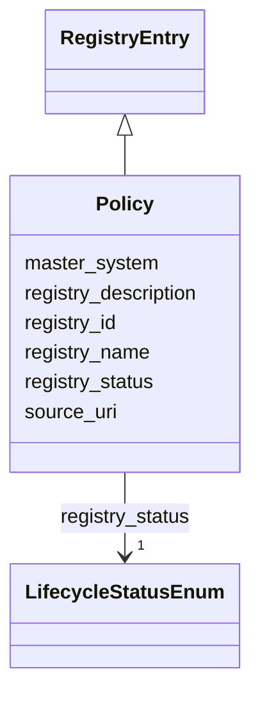

```mermaid
 classDiagram
    class Policy
    click Policy href "../Policy"
      RegistryEntry <|-- Policy
        click RegistryEntry href "../RegistryEntry"
      
      Policy : master_system
        
      Policy : registry_description
        
      Policy : registry_id
        
      Policy : registry_name
        
      Policy : registry_status
        
          
    
        
        
        Policy --> "1" LifecycleStatusEnum : registry_status
        click LifecycleStatusEnum href "../LifecycleStatusEnum"
    

        
      Policy : source_uri
        
      
```
