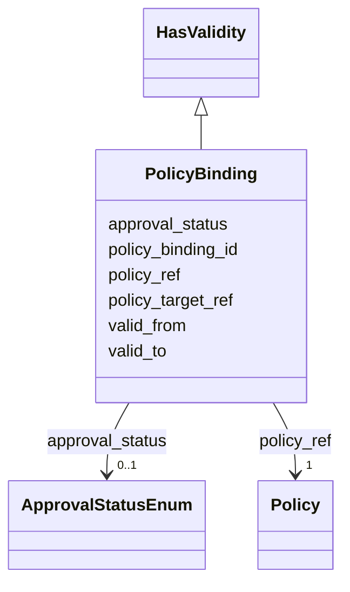

```mermaid
 classDiagram
    class PolicyBinding
    click PolicyBinding href "../PolicyBinding"
      HasValidity <|-- PolicyBinding
        click HasValidity href "../HasValidity"
      
      PolicyBinding : approval_status
        
          
    
        
        
        PolicyBinding --> "0..1" ApprovalStatusEnum : approval_status
        click ApprovalStatusEnum href "../ApprovalStatusEnum"
    

        
      PolicyBinding : policy_binding_id
        
      PolicyBinding : policy_ref
        
          
    
        
        
        PolicyBinding --> "1" Policy : policy_ref
        click Policy href "../Policy"
    

        
      PolicyBinding : policy_target_ref
        
      PolicyBinding : valid_from
        
      PolicyBinding : valid_to
        
      
```
