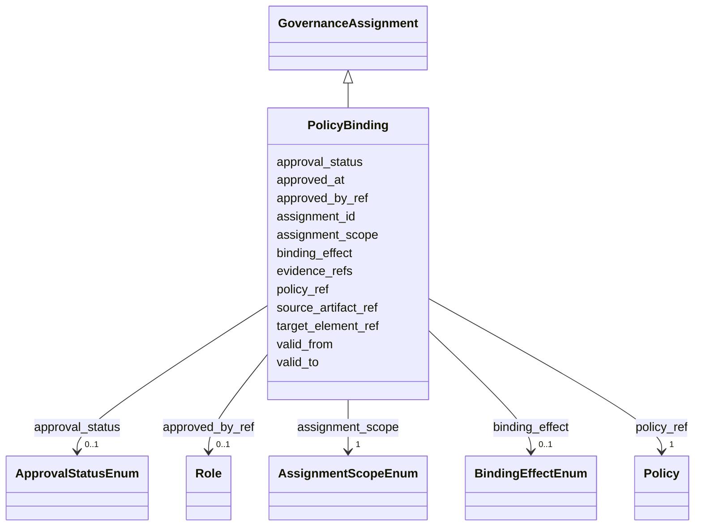

```mermaid
 classDiagram
    class PolicyBinding
    click PolicyBinding href "../PolicyBinding"
      GovernanceAssignment <|-- PolicyBinding
        click GovernanceAssignment href "../GovernanceAssignment"
      
      PolicyBinding : approval_status
        
          
    
        
        
        PolicyBinding --> "0..1" ApprovalStatusEnum : approval_status
        click ApprovalStatusEnum href "../ApprovalStatusEnum"
    

        
      PolicyBinding : approved_at
        
      PolicyBinding : approved_by_ref
        
          
    
        
        
        PolicyBinding --> "0..1" Role : approved_by_ref
        click Role href "../Role"
    

        
      PolicyBinding : assignment_id
        
      PolicyBinding : assignment_scope
        
          
    
        
        
        PolicyBinding --> "1" AssignmentScopeEnum : assignment_scope
        click AssignmentScopeEnum href "../AssignmentScopeEnum"
    

        
      PolicyBinding : binding_effect
        
          
    
        
        
        PolicyBinding --> "0..1" BindingEffectEnum : binding_effect
        click BindingEffectEnum href "../BindingEffectEnum"
    

        
      PolicyBinding : evidence_refs
        
      PolicyBinding : policy_ref
        
          
    
        
        
        PolicyBinding --> "1" Policy : policy_ref
        click Policy href "../Policy"
    

        
      PolicyBinding : source_artifact_ref
        
      PolicyBinding : target_element_ref
        
      PolicyBinding : valid_from
        
      PolicyBinding : valid_to
        
      
```
