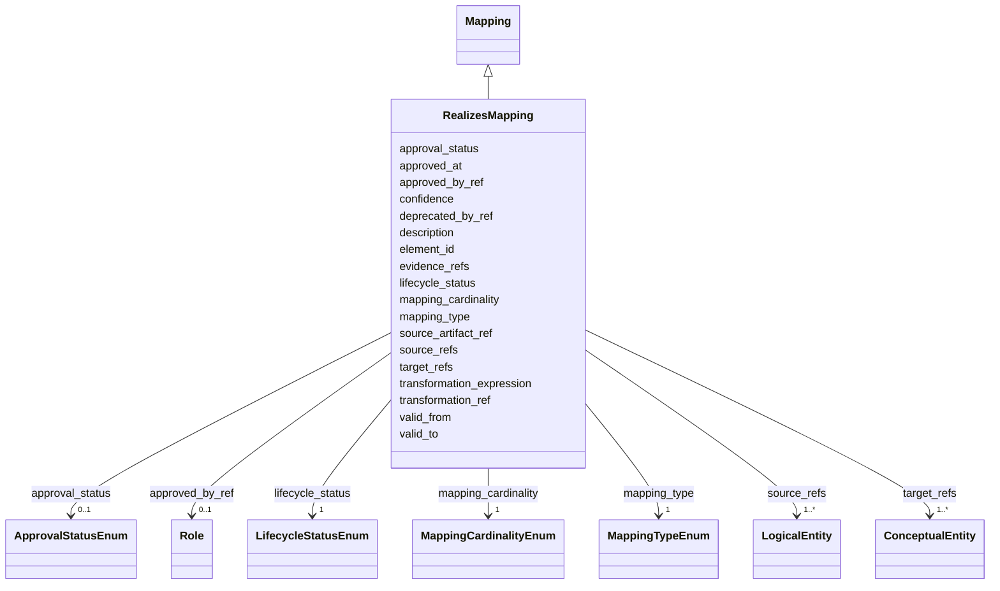

```mermaid
 classDiagram
    class RealizesMapping
    click RealizesMapping href "../RealizesMapping"
      Mapping <|-- RealizesMapping
        click Mapping href "../Mapping"
      
      RealizesMapping : approval_status
        
          
    
        
        
        RealizesMapping --> "0..1" ApprovalStatusEnum : approval_status
        click ApprovalStatusEnum href "../ApprovalStatusEnum"
    

        
      RealizesMapping : approved_at
        
      RealizesMapping : approved_by_ref
        
          
    
        
        
        RealizesMapping --> "0..1" Role : approved_by_ref
        click Role href "../Role"
    

        
      RealizesMapping : confidence
        
      RealizesMapping : deprecated_by_ref
        
      RealizesMapping : description
        
      RealizesMapping : element_id
        
      RealizesMapping : evidence_refs
        
      RealizesMapping : lifecycle_status
        
          
    
        
        
        RealizesMapping --> "1" LifecycleStatusEnum : lifecycle_status
        click LifecycleStatusEnum href "../LifecycleStatusEnum"
    

        
      RealizesMapping : mapping_cardinality
        
          
    
        
        
        RealizesMapping --> "1" MappingCardinalityEnum : mapping_cardinality
        click MappingCardinalityEnum href "../MappingCardinalityEnum"
    

        
      RealizesMapping : mapping_type
        
          
    
        
        
        RealizesMapping --> "1" MappingTypeEnum : mapping_type
        click MappingTypeEnum href "../MappingTypeEnum"
    

        
      RealizesMapping : source_artifact_ref
        
      RealizesMapping : source_refs
        
          
    
        
        
        RealizesMapping --> "1..*" LogicalEntity : source_refs
        click LogicalEntity href "../LogicalEntity"
    

        
      RealizesMapping : target_refs
        
          
    
        
        
        RealizesMapping --> "1..*" ConceptualEntity : target_refs
        click ConceptualEntity href "../ConceptualEntity"
    

        
      RealizesMapping : transformation_expression
        
      RealizesMapping : transformation_ref
        
      RealizesMapping : valid_from
        
      RealizesMapping : valid_to
        
      
```
