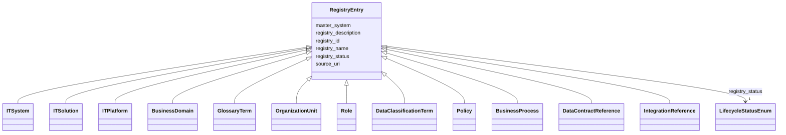

```mermaid
 classDiagram
    class RegistryEntry
    click RegistryEntry href "../RegistryEntry"
      RegistryEntry <|-- ITSystem
        click ITSystem href "../ITSystem"
      RegistryEntry <|-- ITSolution
        click ITSolution href "../ITSolution"
      RegistryEntry <|-- ITPlatform
        click ITPlatform href "../ITPlatform"
      RegistryEntry <|-- BusinessDomain
        click BusinessDomain href "../BusinessDomain"
      RegistryEntry <|-- GlossaryTerm
        click GlossaryTerm href "../GlossaryTerm"
      RegistryEntry <|-- OrganizationUnit
        click OrganizationUnit href "../OrganizationUnit"
      RegistryEntry <|-- Role
        click Role href "../Role"
      RegistryEntry <|-- DataClassificationTerm
        click DataClassificationTerm href "../DataClassificationTerm"
      RegistryEntry <|-- Policy
        click Policy href "../Policy"
      RegistryEntry <|-- BusinessProcess
        click BusinessProcess href "../BusinessProcess"
      RegistryEntry <|-- DataContractReference
        click DataContractReference href "../DataContractReference"
      RegistryEntry <|-- IntegrationReference
        click IntegrationReference href "../IntegrationReference"
      
      RegistryEntry : master_system
        
      RegistryEntry : registry_description
        
      RegistryEntry : registry_id
        
      RegistryEntry : registry_name
        
      RegistryEntry : registry_status
        
          
    
        
        
        RegistryEntry --> "1" LifecycleStatusEnum : registry_status
        click LifecycleStatusEnum href "../LifecycleStatusEnum"
    

        
      RegistryEntry : source_uri
        
      
```
