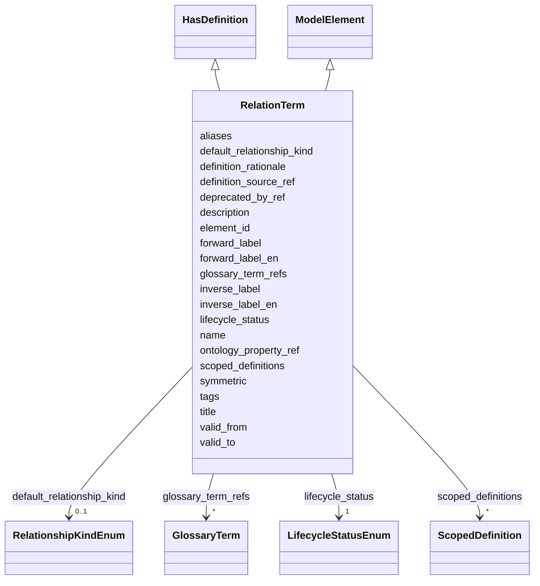

```mermaid
 classDiagram
    class RelationTerm
    click RelationTerm href "../RelationTerm"
      HasDefinition <|-- RelationTerm
        click HasDefinition href "../HasDefinition"
      ModelElement <|-- RelationTerm
        click ModelElement href "../ModelElement"
      
      RelationTerm : aliases
        
      RelationTerm : default_relationship_kind
        
          
    
        
        
        RelationTerm --> "0..1" RelationshipKindEnum : default_relationship_kind
        click RelationshipKindEnum href "../RelationshipKindEnum"
    

        
      RelationTerm : definition_rationale
        
      RelationTerm : definition_source_ref
        
      RelationTerm : deprecated_by_ref
        
      RelationTerm : description
        
      RelationTerm : element_id
        
      RelationTerm : forward_label
        
      RelationTerm : forward_label_en
        
      RelationTerm : glossary_term_refs
        
          
    
        
        
        RelationTerm --> "*" GlossaryTerm : glossary_term_refs
        click GlossaryTerm href "../GlossaryTerm"
    

        
      RelationTerm : inverse_label
        
      RelationTerm : inverse_label_en
        
      RelationTerm : lifecycle_status
        
          
    
        
        
        RelationTerm --> "1" LifecycleStatusEnum : lifecycle_status
        click LifecycleStatusEnum href "../LifecycleStatusEnum"
    

        
      RelationTerm : name
        
      RelationTerm : ontology_property_ref
        
      RelationTerm : scoped_definitions
        
          
    
        
        
        RelationTerm --> "*" ScopedDefinition : scoped_definitions
        click ScopedDefinition href "../ScopedDefinition"
    

        
      RelationTerm : symmetric
        
      RelationTerm : tags
        
      RelationTerm : title
        
      RelationTerm : valid_from
        
      RelationTerm : valid_to
        
      
```
