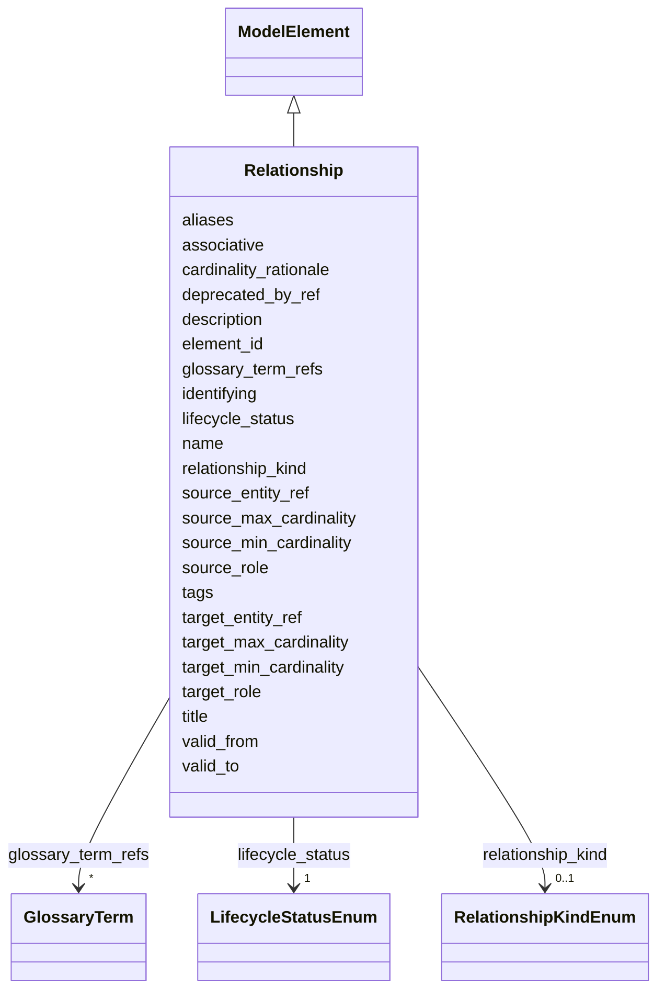

```mermaid
 classDiagram
    class Relationship
    click Relationship href "../Relationship"
      ModelElement <|-- Relationship
        click ModelElement href "../ModelElement"
      
      Relationship : aliases
        
      Relationship : associative
        
      Relationship : cardinality_rationale
        
      Relationship : deprecated_by_ref
        
      Relationship : description
        
      Relationship : element_id
        
      Relationship : glossary_term_refs
        
          
    
        
        
        Relationship --> "*" GlossaryTerm : glossary_term_refs
        click GlossaryTerm href "../GlossaryTerm"
    

        
      Relationship : identifying
        
      Relationship : lifecycle_status
        
          
    
        
        
        Relationship --> "1" LifecycleStatusEnum : lifecycle_status
        click LifecycleStatusEnum href "../LifecycleStatusEnum"
    

        
      Relationship : name
        
      Relationship : relationship_kind
        
          
    
        
        
        Relationship --> "0..1" RelationshipKindEnum : relationship_kind
        click RelationshipKindEnum href "../RelationshipKindEnum"
    

        
      Relationship : source_entity_ref
        
      Relationship : source_max_cardinality
        
      Relationship : source_min_cardinality
        
      Relationship : source_role
        
      Relationship : tags
        
      Relationship : target_entity_ref
        
      Relationship : target_max_cardinality
        
      Relationship : target_min_cardinality
        
      Relationship : target_role
        
      Relationship : title
        
      Relationship : valid_from
        
      Relationship : valid_to
        
      
```
